# Emergency vehicle navigation: project and graph guide

This project studies how an emergency vehicle receives an accident alert and chooses a route through traffic. The Word report contains the complete project explanation and the same 47 graphs.

## How the system works

1. Create a small road network with 16 junctions and traffic lights. Put three roadside units (RSUs) beside the roads. Each RSU can communicate within a 400 m radio neighborhood.

2. Add normal traffic to the roads. The low, medium, and high traffic scenarios contain 72, 144, and 200 background vehicles. Thirty random seeds give different trips for each scenario.

3. Start the emergency event. An accident vehicle stops, and the nearby RSU sends one 256-byte emergency message through the vehicle and roadside network to the emergency vehicle (EV).

4. When the EV receives the message, calculate a route to the accident using the selected routing configuration. Some configurations use a fixed A* route; the dynamic configurations review live road costs every five seconds.

5. While the EV drives, it requests priority at traffic lights. Dynamic routing changes the route only when a better route passes the improvement and stability rules.

6. In the Mist with Fog configuration, Mist normally computes the route. The simulated onboard unit spends an assumed 20 ms validating each recently received road message. If Mist has not finished after 800 ms, Fog takes over the route decision.

7. Record whether the message arrived, how long communication and route decisions took, how the EV traveled, and how many reviews, route changes, and fallback events occurred. Each run has a 900 second observation window.

8. Repeat the experiment for four configurations, three traffic levels, and 30 matched seeds: 360 runs. Calculate averages and 95% confidence intervals from the recorded results, then draw the graphs.

## How to read the figures

Each bar is a density and configuration mean. Error bars show 95% confidence intervals; the exact methods are in [METHODOLOGY.md](METHODOLOGY.md). Metrics requiring EM delivery use only valid delivered runs. PDR, EM throughput, and fallback activation use all 30 scheduled runs where applicable. A missing low-density fallback decision graph means no fallback activated there; it is not a measured latency of zero.

## All 47 graphs

### Packet delivery ratio

The share of generated emergency messages that reached the EV. Higher is better.

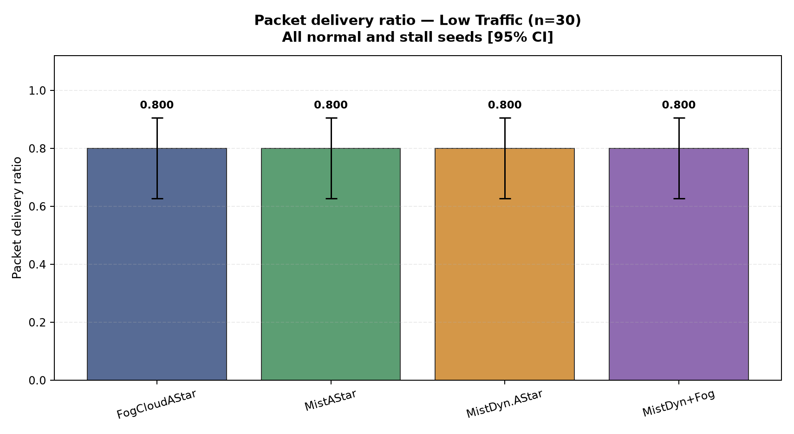

Low traffic (72 background vehicles): Fog/Cloud 0.800; Mist 0.800; Mist Dynamic 0.800; Mist + Fog 0.800. Bars show means and 95% confidence intervals.

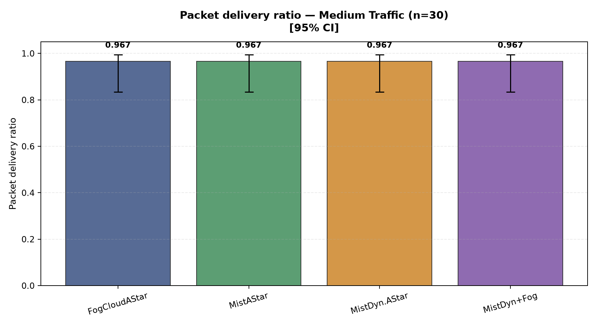

Medium traffic (144 background vehicles): Fog/Cloud 0.967; Mist 0.967; Mist Dynamic 0.967; Mist + Fog 0.967. Bars show means and 95% confidence intervals.

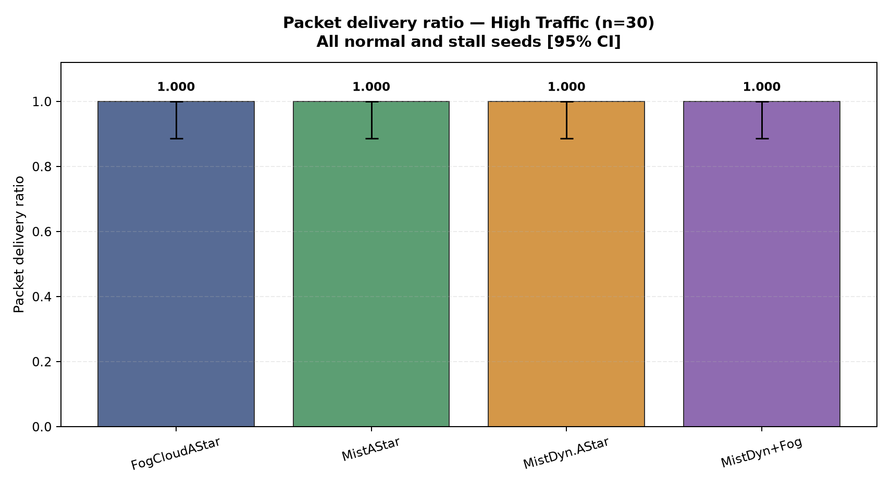

High traffic (200 background vehicles): Fog/Cloud 1.000; Mist 1.000; Mist Dynamic 1.000; Mist + Fog 1.000. Bars show means and 95% confidence intervals.

### Normalized routing load

Control and EM transmissions per delivered emergency message. Lower means less communication overhead.

Low traffic (72 background vehicles): Fog/Cloud 22,035; Mist 22,025; Mist Dynamic 22,051; Mist + Fog 22,051. Bars show means and 95% confidence intervals.

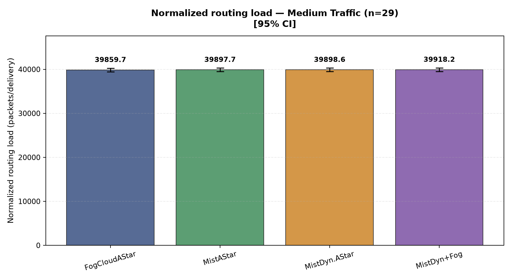

Medium traffic (144 background vehicles): Fog/Cloud 39,860; Mist 39,898; Mist Dynamic 39,899; Mist + Fog 39,918. Bars show means and 95% confidence intervals.

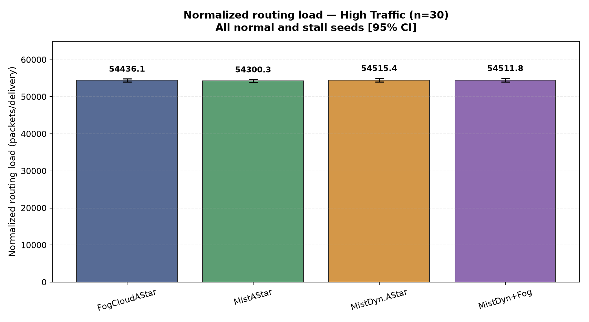

High traffic (200 background vehicles): Fog/Cloud 54,479; Mist 54,432; Mist Dynamic 54,453; Mist + Fog 54,463. Bars show means and 95% confidence intervals.

### EM throughput

Delivered EM payload bits divided by the fixed 900 second observation window. One delivery contributes 2.27556 bit/s.

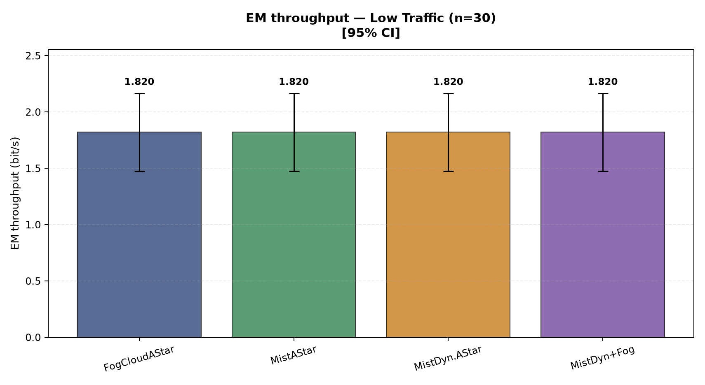

Low traffic (72 background vehicles): Fog/Cloud 1.820; Mist 1.820; Mist Dynamic 1.820; Mist + Fog 1.820. Bars show means and 95% confidence intervals.

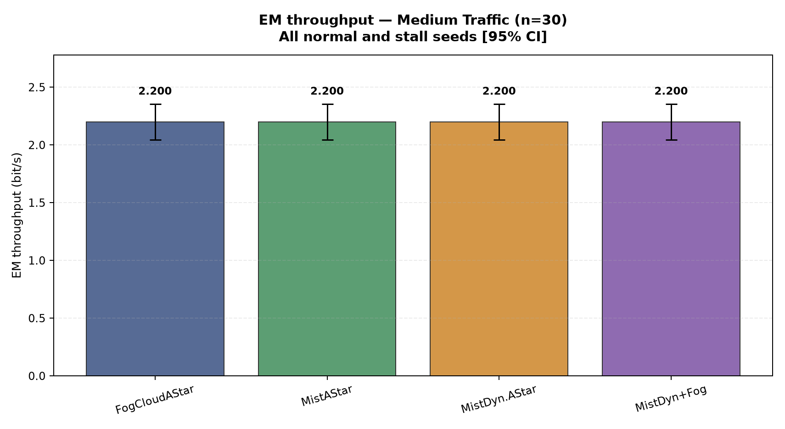

Medium traffic (144 background vehicles): Fog/Cloud 2.200; Mist 2.200; Mist Dynamic 2.200; Mist + Fog 2.200. Bars show means and 95% confidence intervals.

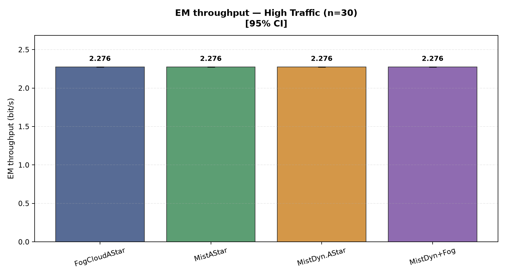

High traffic (200 background vehicles): Fog/Cloud 2.276; Mist 2.276; Mist Dynamic 2.276; Mist + Fog 2.276. Bars show means and 95% confidence intervals.

### EM end-to-end delay

Time from RSU message generation to EV reception, in milliseconds. Lower is faster.

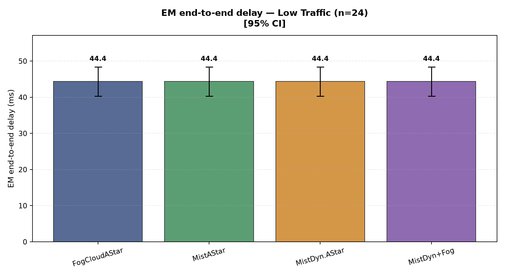

Low traffic (72 background vehicles): Fog/Cloud 44.4; Mist 44.4; Mist Dynamic 44.4; Mist + Fog 44.4. Bars show means and 95% confidence intervals.

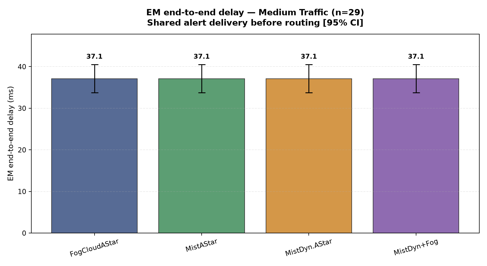

Medium traffic (144 background vehicles): Fog/Cloud 37.1; Mist 37.1; Mist Dynamic 37.1; Mist + Fog 37.1. Bars show means and 95% confidence intervals.

High traffic (200 background vehicles): Fog/Cloud 32.2; Mist 32.2; Mist Dynamic 32.2; Mist + Fog 32.2. Bars show means and 95% confidence intervals.

### Route decision latency

Time from EV message reception to the initial route being applied, in milliseconds.

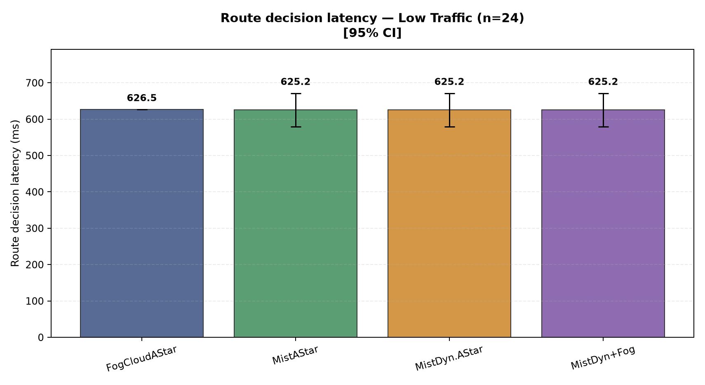

Low traffic (72 background vehicles): Fog/Cloud 626.5; Mist 625.2; Mist Dynamic 625.2; Mist + Fog 625.2. Bars show means and 95% confidence intervals.

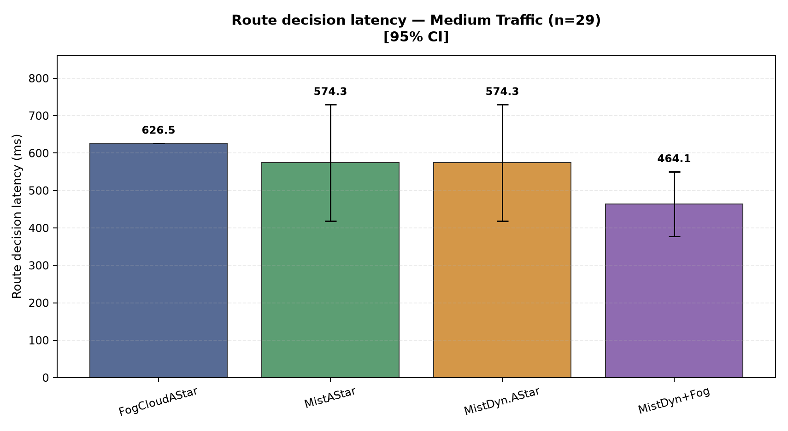

Medium traffic (144 background vehicles): Fog/Cloud 626.5; Mist 844.6; Mist Dynamic 844.6; Mist + Fog 946.4. Bars show means and 95% confidence intervals.

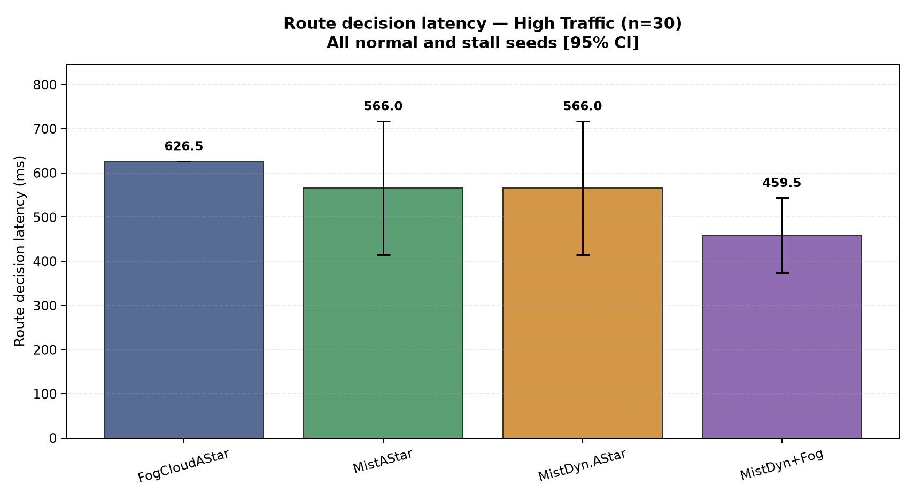

High traffic (200 background vehicles): Fog/Cloud 626.5; Mist 1075.3; Mist Dynamic 1075.3; Mist + Fog 1087.2. Bars show means and 95% confidence intervals.

### EV response time

Time from emergency message generation until the EV reaches the accident, in seconds.

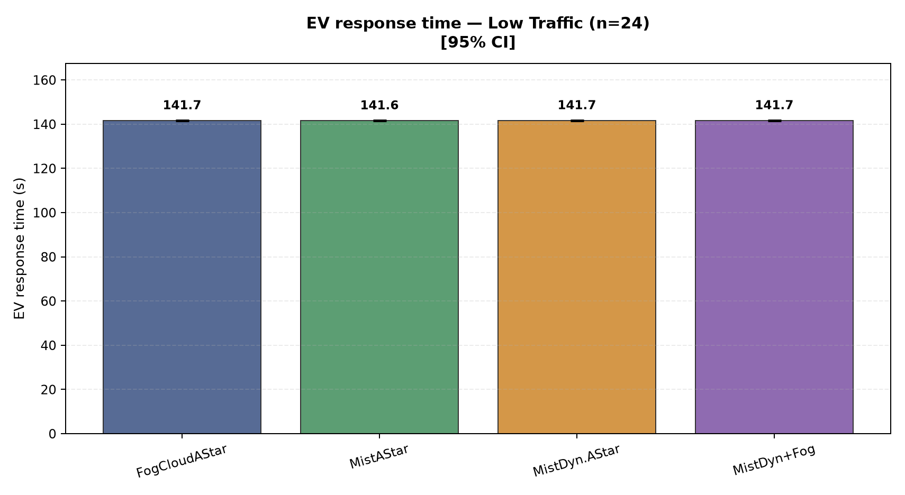

Low traffic (72 background vehicles): Fog/Cloud 141.7; Mist 141.6; Mist Dynamic 141.7; Mist + Fog 141.7. Bars show means and 95% confidence intervals.

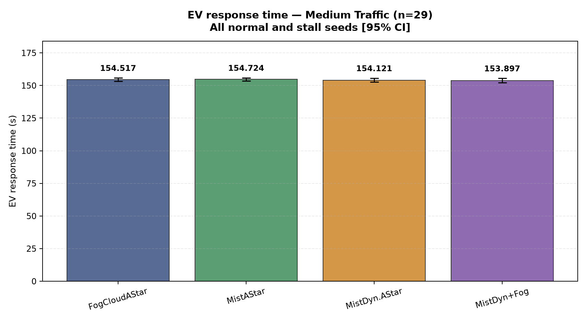

Medium traffic (144 background vehicles): Fog/Cloud 141.5; Mist 141.7; Mist Dynamic 141.7; Mist + Fog 141.9. Bars show means and 95% confidence intervals.

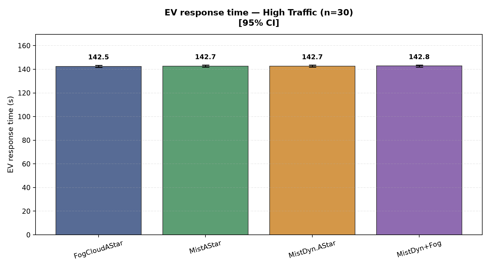

High traffic (200 background vehicles): Fog/Cloud 142.5; Mist 142.7; Mist Dynamic 142.7; Mist + Fog 142.8. Bars show means and 95% confidence intervals.

### EV traffic-light waiting time

EV standstill near a signal stop line, in seconds. A value of zero means no measured wait.

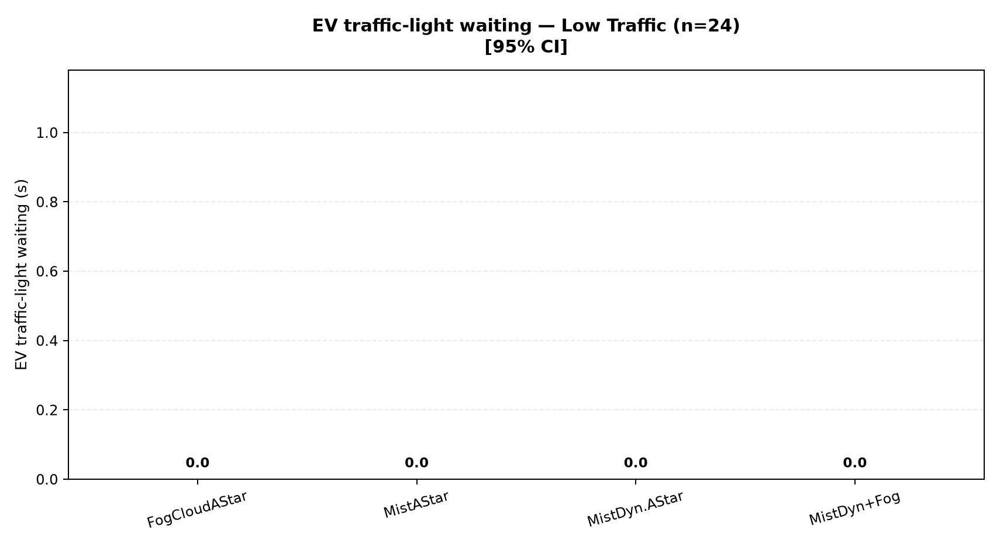

Low traffic (72 background vehicles): Fog/Cloud 0.0; Mist 0.0; Mist Dynamic 0.0; Mist + Fog 0.0. Bars show means and 95% confidence intervals.

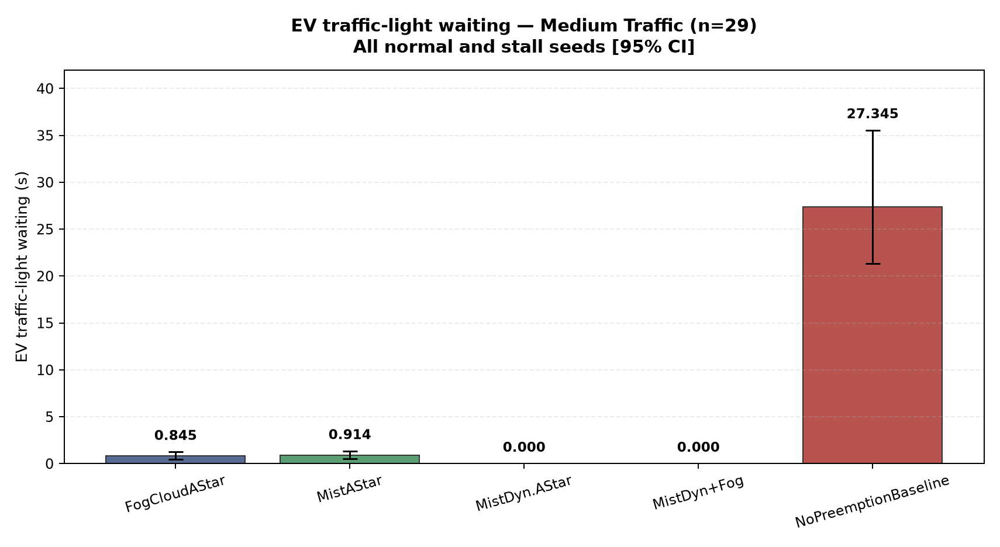

Medium traffic (144 background vehicles): Fog/Cloud 0.0; Mist 0.0; Mist Dynamic 0.0; Mist + Fog 0.0. Bars show means and 95% confidence intervals.

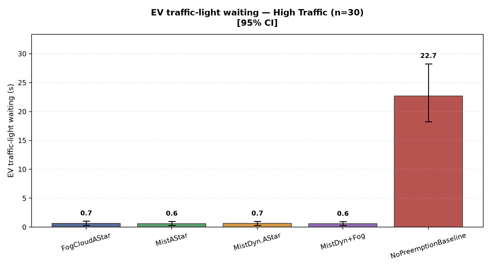

High traffic (200 background vehicles): Fog/Cloud 0.0; Mist 0.0; Mist Dynamic 0.1; Mist + Fog 0.1. Bars show means and 95% confidence intervals.

### Fallback activation rate

Share of fallback-configuration runs where the 800 ms Mist watchdog requested Fog.

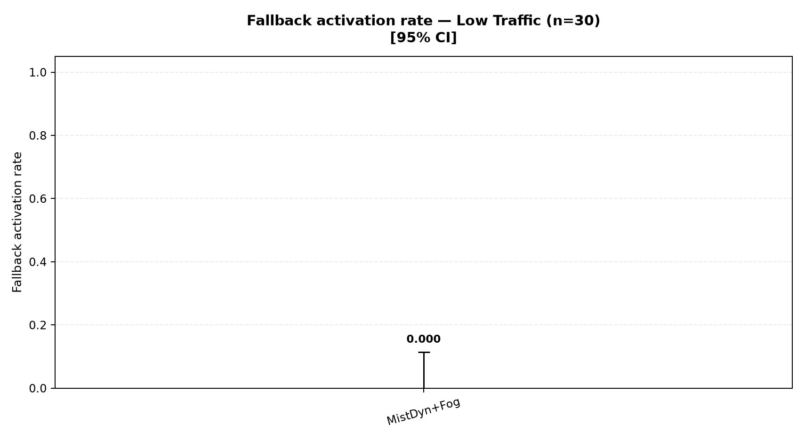

Low traffic (72 background vehicles): Mist + Fog 0.000. Bars show means and 95% confidence intervals.

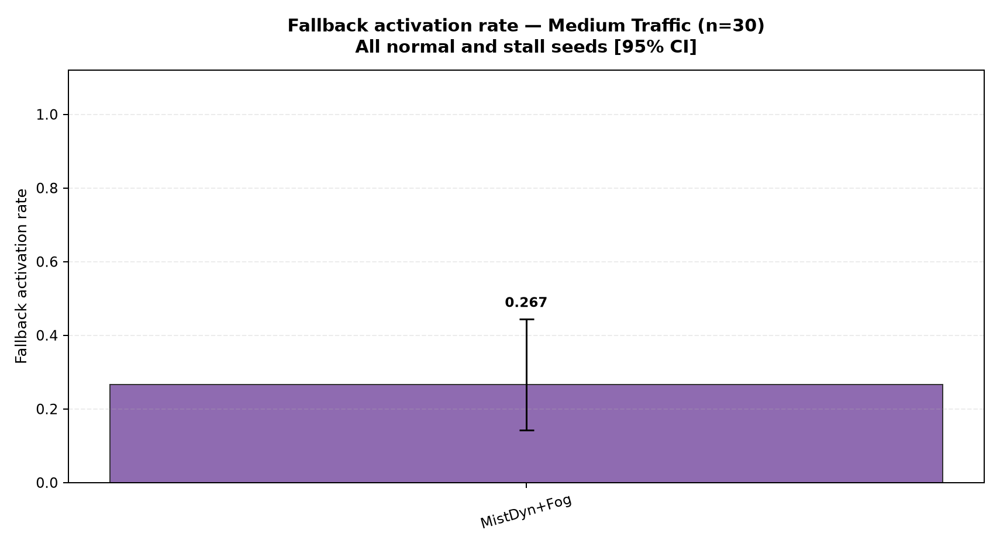

Medium traffic (144 background vehicles): Mist + Fog 0.600. Bars show means and 95% confidence intervals.

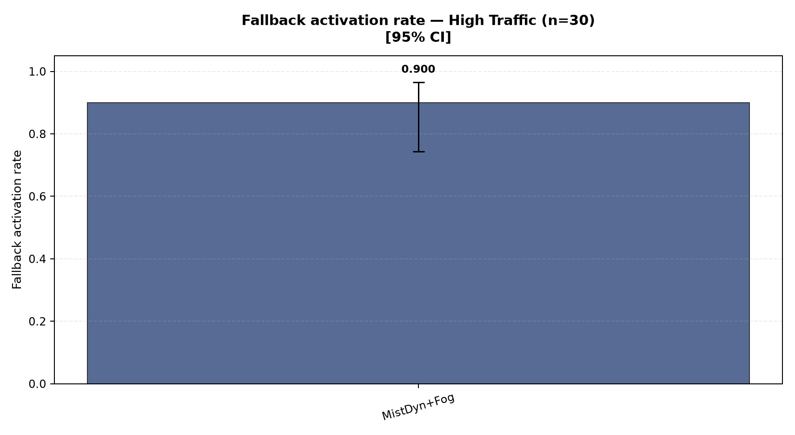

High traffic (200 background vehicles): Mist + Fog 0.900. Bars show means and 95% confidence intervals.

### Applied route changes

Mean number of actual congestion or cost reroutes per run. Reviews without a replacement are excluded.

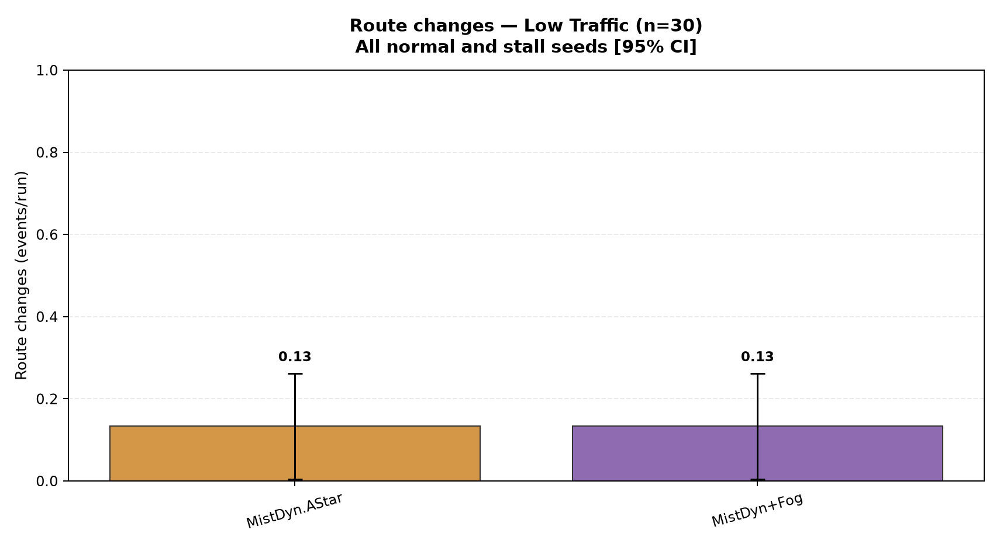

Low traffic (72 background vehicles): Mist Dynamic 0.10; Mist + Fog 0.10. Bars show means and 95% confidence intervals.

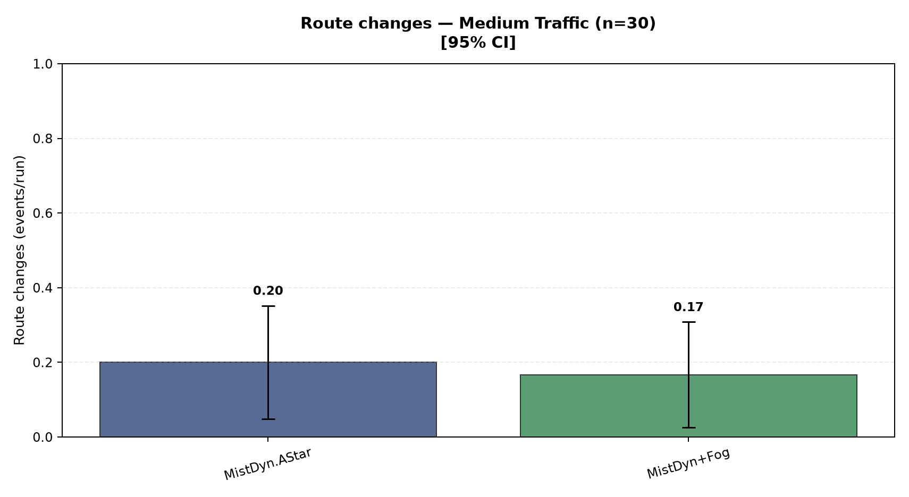

Medium traffic (144 background vehicles): Mist Dynamic 0.20; Mist + Fog 0.17. Bars show means and 95% confidence intervals.

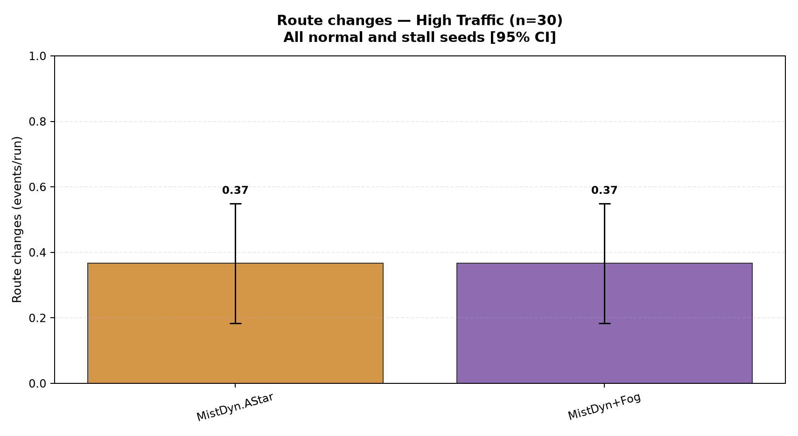

High traffic (200 background vehicles): Mist Dynamic 0.20; Mist + Fog 0.17. Bars show means and 95% confidence intervals.

### Route computation frequency

Mean number of periodic Dynamic A* route evaluations per run, normally scheduled every five seconds.

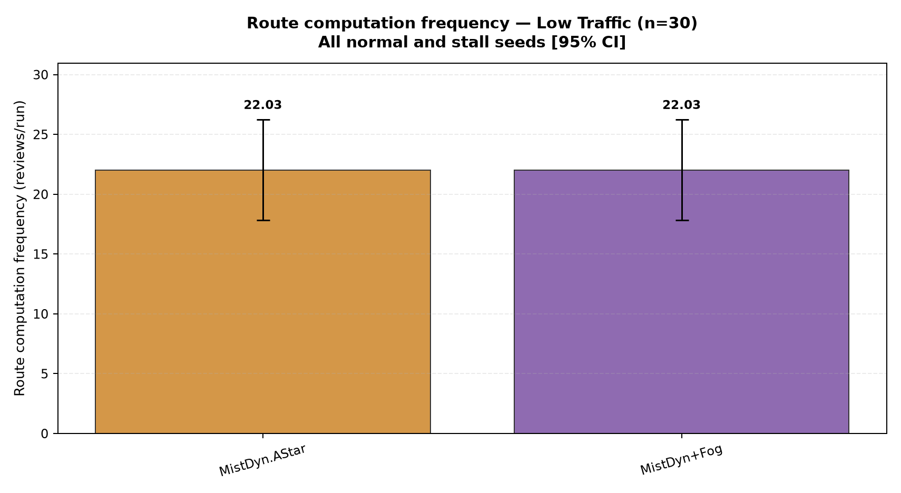

Low traffic (72 background vehicles): Mist Dynamic 20.83; Mist + Fog 20.83. Bars show means and 95% confidence intervals.

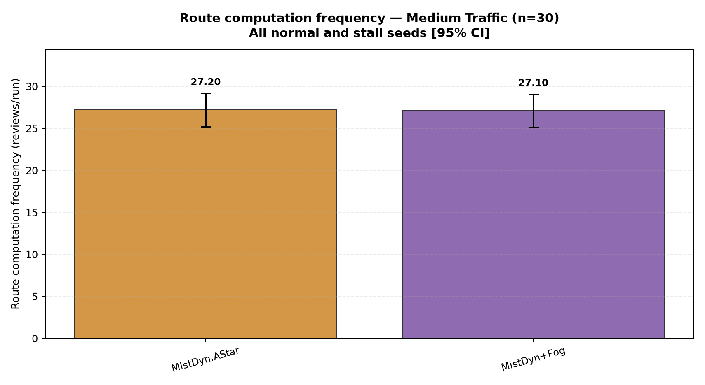

Medium traffic (144 background vehicles): Mist Dynamic 25.27; Mist + Fog 25.27. Bars show means and 95% confidence intervals.

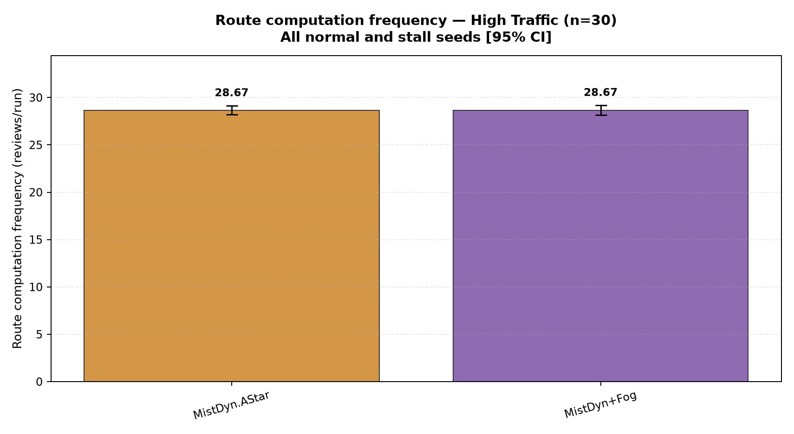

High traffic (200 background vehicles): Mist Dynamic 26.13; Mist + Fog 26.17. Bars show means and 95% confidence intervals.

### Fallback decision latency

Time to apply the Fog route in runs where the watchdog actually triggered, in milliseconds.

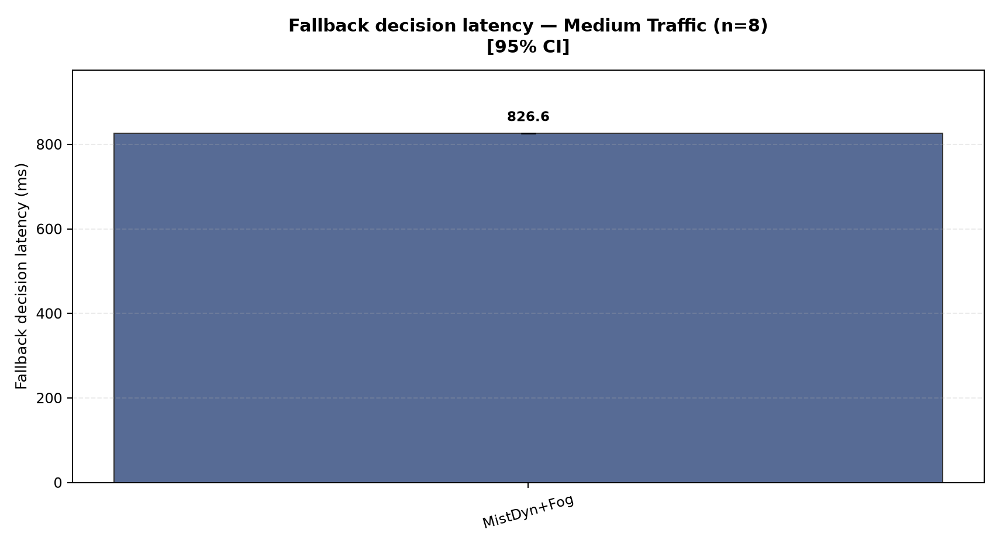

Medium traffic (144 background vehicles): Mist + Fog 1126.6. Bars show means and 95% confidence intervals.

High traffic (200 background vehicles): Mist + Fog 1126.6. Bars show means and 95% confidence intervals.

### Control transmissions

Mean number of control-packet transmissions per run. This is supporting communication-load evidence.

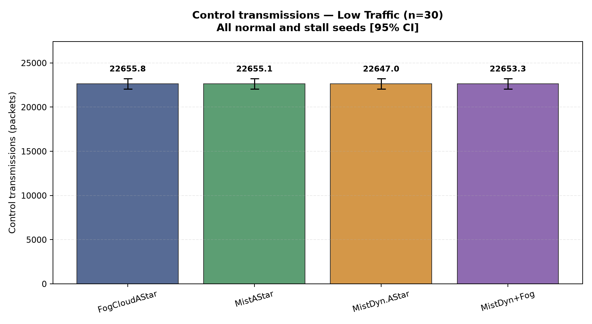

Low traffic (72 background vehicles): Fog/Cloud 22,659; Mist 22,651; Mist Dynamic 22,672; Mist + Fog 22,672. Bars show means and 95% confidence intervals.

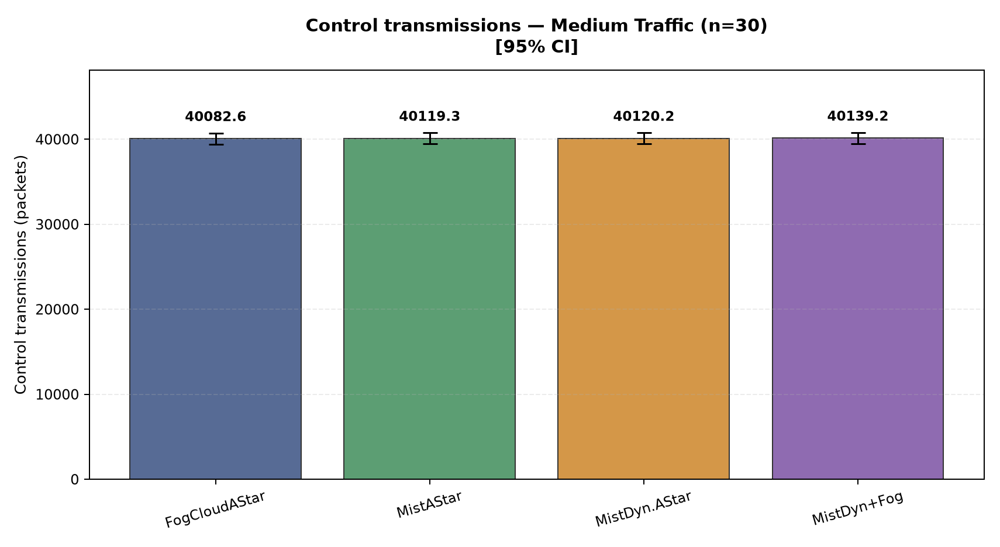

Medium traffic (144 background vehicles): Fog/Cloud 40,083; Mist 40,119; Mist Dynamic 40,120; Mist + Fog 40,139. Bars show means and 95% confidence intervals.

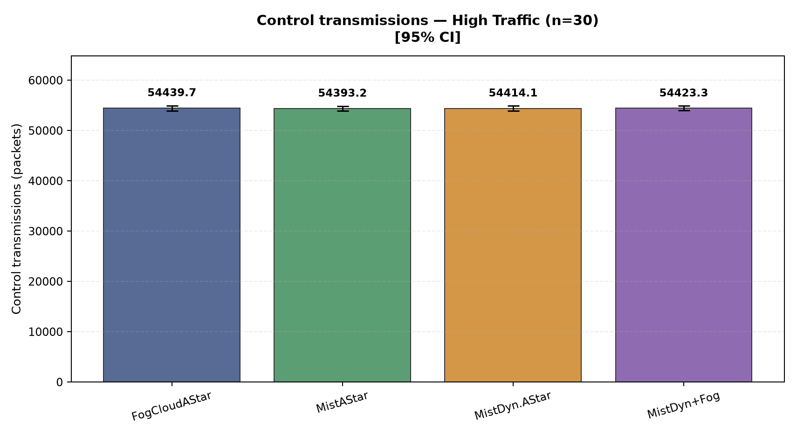

High traffic (200 background vehicles): Fog/Cloud 54,440; Mist 54,393; Mist Dynamic 54,414; Mist + Fog 54,423. Bars show means and 95% confidence intervals.

### Control bytes

Mean control traffic volume in bytes per run. This is supporting communication-load evidence.

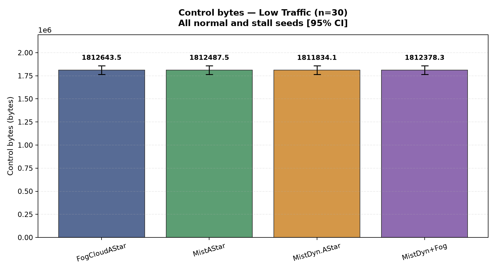

Low traffic (72 background vehicles): Fog/Cloud 1,812,931; Mist 1,812,194; Mist Dynamic 1,813,863; Mist + Fog 1,813,863. Bars show means and 95% confidence intervals.

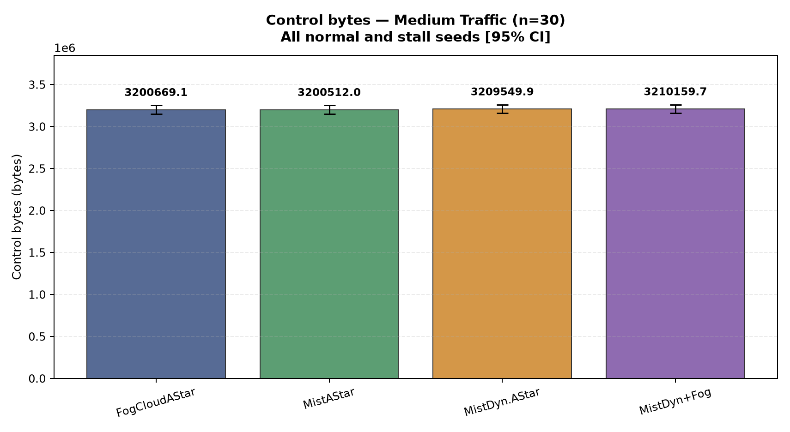

Medium traffic (144 background vehicles): Fog/Cloud 3,206,824; Mist 3,209,639; Mist Dynamic 3,209,711; Mist + Fog 3,211,360. Bars show means and 95% confidence intervals.

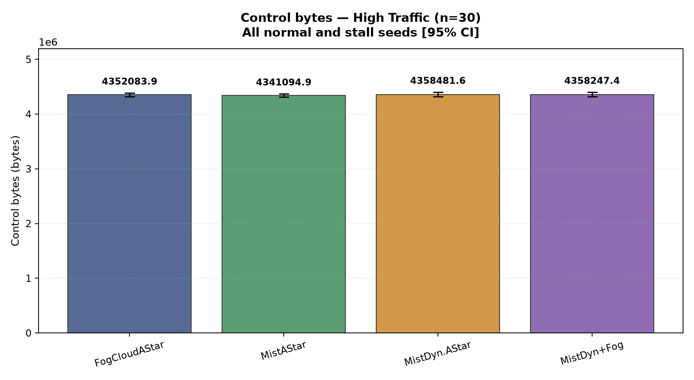

High traffic (200 background vehicles): Fog/Cloud 4,355,397; Mist 4,351,549; Mist Dynamic 4,353,224; Mist + Fog 4,354,169. Bars show means and 95% confidence intervals.

### EV corridor delay versus free flow

Extra travel time relative to the modeled free-flow corridor, in seconds.

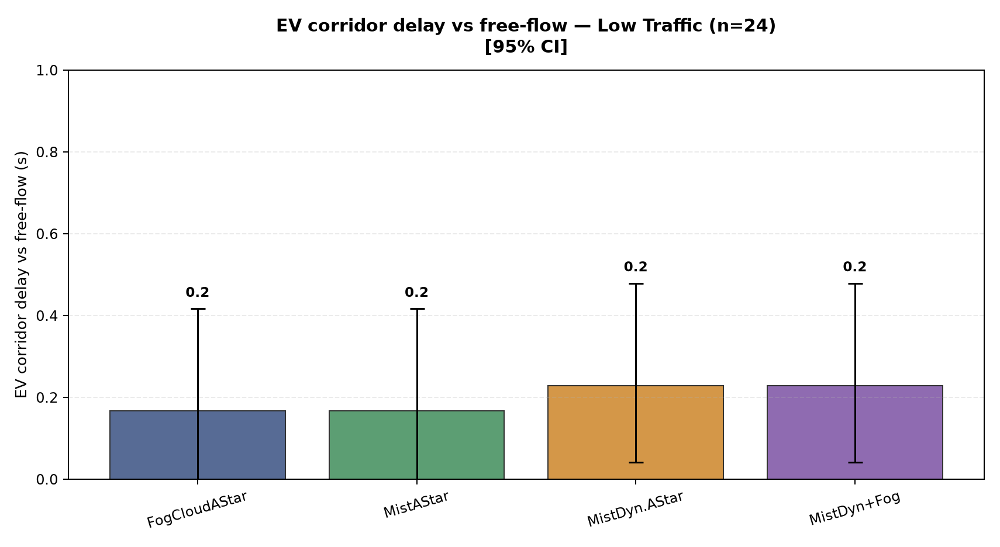

Low traffic (72 background vehicles): Fog/Cloud 0.2; Mist 0.2; Mist Dynamic 0.2; Mist + Fog 0.2. Bars show means and 95% confidence intervals.

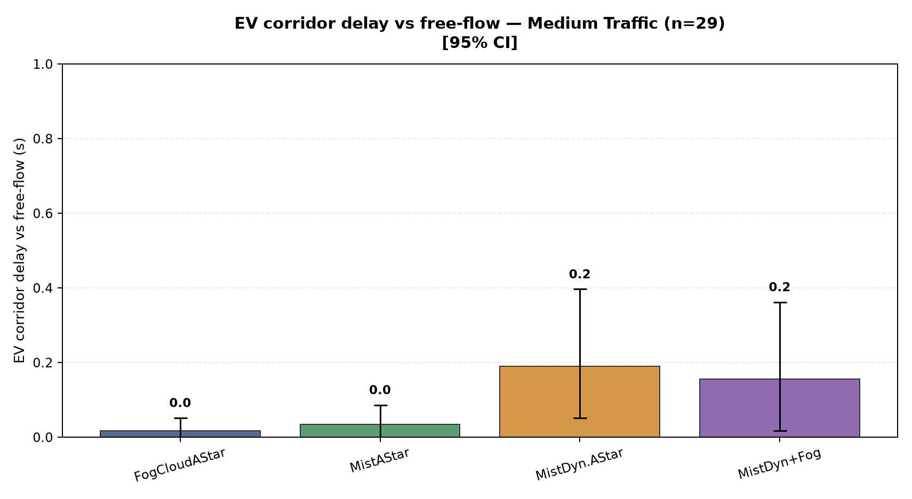

Medium traffic (144 background vehicles): Fog/Cloud 0.0; Mist 0.0; Mist Dynamic 0.2; Mist + Fog 0.2. Bars show means and 95% confidence intervals.

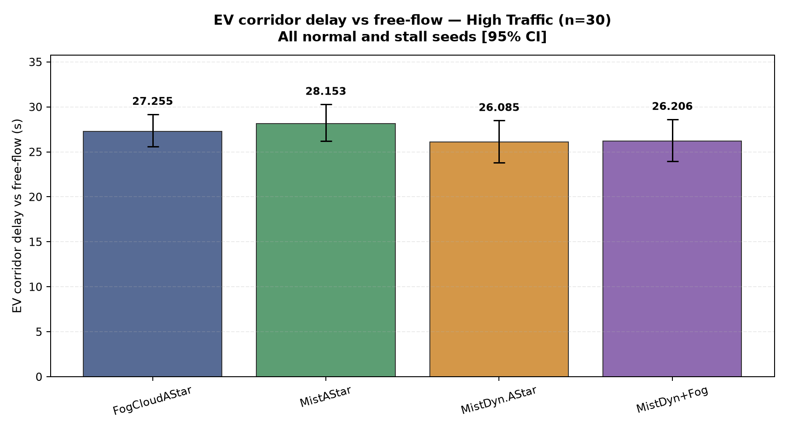

High traffic (200 background vehicles): Fog/Cloud 1.0; Mist 0.9; Mist Dynamic 1.0; Mist + Fog 1.0. Bars show means and 95% confidence intervals.

### EV route distance

Distance traveled by the EV to reach the accident, in metres.

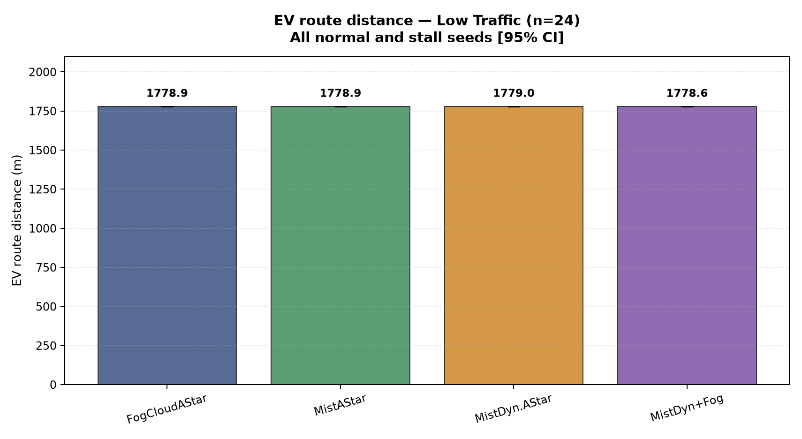

Low traffic (72 background vehicles): Fog/Cloud 1776.8; Mist 1776.8; Mist Dynamic 1777.5; Mist + Fog 1777.5. Bars show means and 95% confidence intervals.

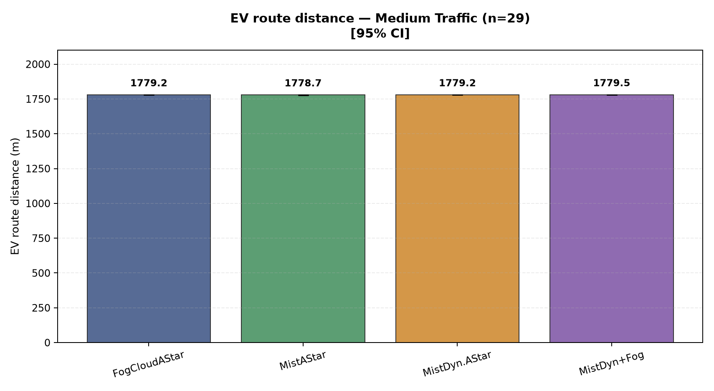

Medium traffic (144 background vehicles): Fog/Cloud 1776.6; Mist 1776.6; Mist Dynamic 1778.3; Mist + Fog 1777.9. Bars show means and 95% confidence intervals.

High traffic (200 background vehicles): Fog/Cloud 1777.1; Mist 1776.8; Mist Dynamic 1778.4; Mist + Fog 1778.4. Bars show means and 95% confidence intervals.

### EV travel time

EV movement time from departure to accident arrival, in seconds.

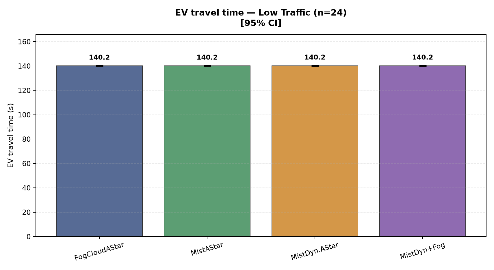

Low traffic (72 background vehicles): Fog/Cloud 140.2; Mist 140.2; Mist Dynamic 140.2; Mist + Fog 140.2. Bars show means and 95% confidence intervals.

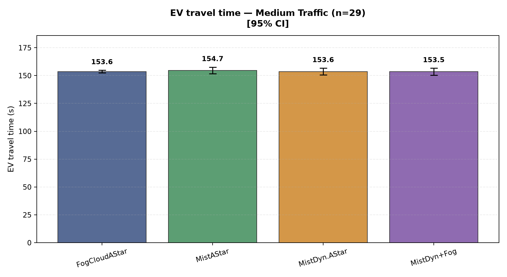

Medium traffic (144 background vehicles): Fog/Cloud 140.0; Mist 140.0; Mist Dynamic 140.1; Mist + Fog 140.1. Bars show means and 95% confidence intervals.

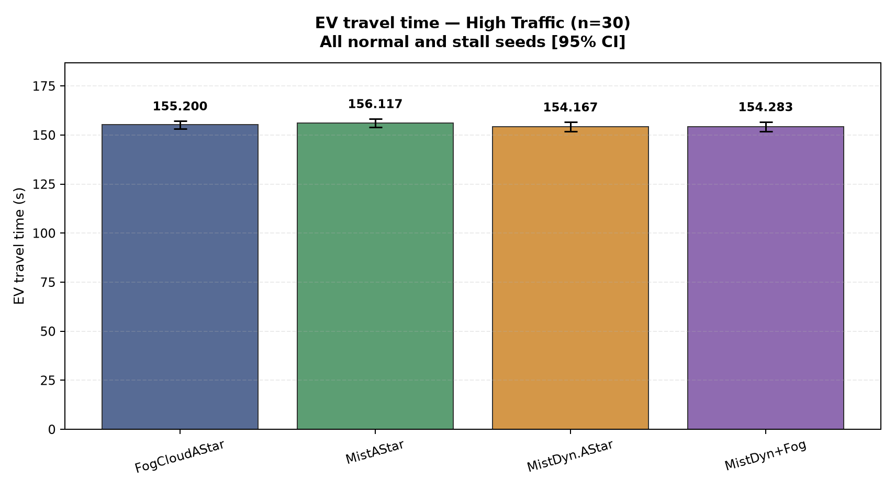

High traffic (200 background vehicles): Fog/Cloud 141.0; Mist 140.9; Mist Dynamic 140.9; Mist + Fog 140.8. Bars show means and 95% confidence intervals.

The complete numeric means, valid sample sizes, standard deviations, and intervals are in `../results/processed/summary-batch.csv`. The seven main measures are also tabulated in `VERIFICATION.md`.
