# Emergency vehicle navigation project and graph guide

This project studies how an emergency vehicle receives an accident alert and chooses a route through traffic. The Word report contains the complete project explanation and the same 100 graphs.

## How the system works

1. Create a small road network with 16 junctions and traffic lights. Put three roadside units (RSUs) beside the roads. Each RSU can communicate within a 400 m radio neighborhood.

2. Add normal traffic to the roads. The low, medium, and high traffic scenarios contain 72, 144, and 200 background vehicles. Thirty random seeds give different trips for each scenario.

3. Start the emergency event. An accident vehicle stops, and the nearby RSU sends one 256-byte emergency message through the vehicle and roadside network to the emergency vehicle (EV).

4. When the EV receives the message, calculate a route to the accident using the selected routing configuration. Some configurations use a fixed A* route; the dynamic configurations review live road costs every five seconds.

5. While the EV drives under SUMO safety rules, Fog/Cloud and static Mist request signal priority within 100 m or eight seconds. Dynamic Mist requests earlier, within 250 m or 20 seconds, to prepare the junction before arrival. Requests may retry every five seconds. Active holds reject duplicates and remain bounded at 25 seconds. The controller preserves a ten-second minimum green, then yellow and all-red clearance.

6. Mist normally computes the route with no added telemetry validation delay. Eight independently selected seeds receive a controlled 900 ms Mist stall in all three Mist approaches. In Mist with Fog, unfinished work after 500 ms triggers a Fog request. These are labeled fault tests, not naturally occurring failures.

7. Record whether the message arrived, how long communication and route decisions took, how the EV traveled, and how many reviews, route changes, and fallback events occurred. Each run has a 900 second observation window.

8. Repeat the four primary configurations at three traffic levels and 30 matched seeds: 360 runs. Add 90 no-preemption control runs, displayed only for traffic-light waiting. Calculate averages and 95% confidence intervals, report normal and controlled-stall results separately, and draw the graphs.

## How to read the figures

Each bar is a density and configuration mean. Error bars show 95% confidence intervals; the exact methods are in [METHODOLOGY.md](METHODOLOGY.md). Metrics requiring EM delivery use only valid delivered runs. PDR, EM throughput, and fallback activation use all 30 scheduled runs where applicable. Fallback latency uses only runs where the watchdog actually activated.

## All 100 graphs

### Packet delivery ratio

The share of generated emergency messages that reached the EV. All four approaches share this alert service before route computation; equal bars can be correct.

Low traffic (72 background vehicles): Fog/Cloud 0.800; Mist 0.800; Mist Dynamic 0.800; Mist + Fog 0.800. Bars show means and 95% confidence intervals.

Medium traffic (144 background vehicles): Fog/Cloud 0.967; Mist 0.967; Mist Dynamic 0.967; Mist + Fog 0.967. Bars show means and 95% confidence intervals.

High traffic (200 background vehicles): Fog/Cloud 1.000; Mist 1.000; Mist Dynamic 1.000; Mist + Fog 1.000. Bars show means and 95% confidence intervals.

### Normalized routing load

Control and EM transmissions per delivered emergency message. Lower means less communication overhead.

Low traffic (72 background vehicles): Fog/Cloud 22,038; Mist 22,038; Mist Dynamic 22,059; Mist + Fog 22,062. Bars show means and 95% confidence intervals.

Medium traffic (144 background vehicles): Fog/Cloud 39,779; Mist 39,778; Mist Dynamic 39,893; Mist + Fog 39,900. Bars show means and 95% confidence intervals.

High traffic (200 background vehicles): Fog/Cloud 54,436; Mist 54,300; Mist Dynamic 54,515; Mist + Fog 54,512. Bars show means and 95% confidence intervals.

### EM throughput

Delivered EM payload bits divided by the fixed 900 second observation window. One delivery contributes 2.27556 bit/s. This measures the shared alert service.

Low traffic (72 background vehicles): Fog/Cloud 1.820; Mist 1.820; Mist Dynamic 1.820; Mist + Fog 1.820. Bars show means and 95% confidence intervals.

Medium traffic (144 background vehicles): Fog/Cloud 2.200; Mist 2.200; Mist Dynamic 2.200; Mist + Fog 2.200. Bars show means and 95% confidence intervals.

High traffic (200 background vehicles): Fog/Cloud 2.276; Mist 2.276; Mist Dynamic 2.276; Mist + Fog 2.276. Bars show means and 95% confidence intervals.

### EM end-to-end delay

Time from RSU message generation to EV reception, in milliseconds. It measures the shared alert service before any route computation.

Low traffic (72 background vehicles): Fog/Cloud 44.4; Mist 44.4; Mist Dynamic 44.4; Mist + Fog 44.4. Bars show means and 95% confidence intervals.

Medium traffic (144 background vehicles): Fog/Cloud 37.1; Mist 37.1; Mist Dynamic 37.1; Mist + Fog 37.1. Bars show means and 95% confidence intervals.

High traffic (200 background vehicles): Fog/Cloud 32.2; Mist 32.2; Mist Dynamic 32.2; Mist + Fog 32.2. Bars show means and 95% confidence intervals.

### Route decision latency

Time from EV message reception to the initial route being applied, in milliseconds.

Low traffic (72 background vehicles): Fog/Cloud 626.5; Mist 588.5; Mist Dynamic 588.5; Mist + Fog 472.0. Bars show means and 95% confidence intervals.

Medium traffic (144 background vehicles): Fog/Cloud 626.5; Mist 574.3; Mist Dynamic 574.3; Mist + Fog 464.1. Bars show means and 95% confidence intervals.

High traffic (200 background vehicles): Fog/Cloud 626.5; Mist 566.0; Mist Dynamic 566.0; Mist + Fog 459.5. Bars show means and 95% confidence intervals.

### EV response time

Time from emergency message generation until the EV reaches the accident, in seconds.

Low traffic (72 background vehicles): Fog/Cloud 153.312; Mist 153.500; Mist Dynamic 147.167; Mist + Fog 147.104. Bars show means and 95% confidence intervals.

Medium traffic (144 background vehicles): Fog/Cloud 154.517; Mist 154.724; Mist Dynamic 147.362; Mist + Fog 147.362. Bars show means and 95% confidence intervals.

High traffic (200 background vehicles): Fog/Cloud 156.200; Mist 156.883; Mist Dynamic 147.517; Mist + Fog 146.733. Bars show means and 95% confidence intervals.

### EV traffic-light waiting time

EV standstill near a signal stop line, in seconds. A value of zero means no measured wait.

Low traffic (72 background vehicles): Fog/Cloud 1.562; Mist 1.833; Mist Dynamic 0.000; Mist + Fog 0.000; No preemption 26.292. Bars show means and 95% confidence intervals.

Medium traffic (144 background vehicles): Fog/Cloud 0.845; Mist 0.914; Mist Dynamic 0.000; Mist + Fog 0.000; No preemption 27.345. Bars show means and 95% confidence intervals.

High traffic (200 background vehicles): Fog/Cloud 0.667; Mist 0.717; Mist Dynamic 0.400; Mist + Fog 0.000; No preemption 22.717. Bars show means and 95% confidence intervals.

### Fallback activation rate

Share of Mist with Fog runs where the 500 ms watchdog requested Fog. Controlled stalls are explicitly injected in eight of the 30 seeds.

Low traffic (72 background vehicles): Mist + Fog 0.233. Bars show means and 95% confidence intervals.

Medium traffic (144 background vehicles): Mist + Fog 0.267. Bars show means and 95% confidence intervals.

High traffic (200 background vehicles): Mist + Fog 0.267. Bars show means and 95% confidence intervals.

### Applied route changes

Mean number of actual congestion or cost reroutes per run. Reviews without a replacement are excluded.

Low traffic (72 background vehicles): Mist Dynamic 0.10; Mist + Fog 0.10. Bars show means and 95% confidence intervals.

Medium traffic (144 background vehicles): Mist Dynamic 0.27; Mist + Fog 0.27. Bars show means and 95% confidence intervals.

High traffic (200 background vehicles): Mist Dynamic 0.20; Mist + Fog 0.20. Bars show means and 95% confidence intervals.

### Route computation frequency

Mean number of periodic Dynamic A* route evaluations per run, normally scheduled every five seconds.

Low traffic (72 background vehicles): Mist Dynamic 21.43; Mist + Fog 21.50. Bars show means and 95% confidence intervals.

Medium traffic (144 background vehicles): Mist Dynamic 26.00; Mist + Fog 26.07. Bars show means and 95% confidence intervals.

High traffic (200 background vehicles): Mist Dynamic 26.90; Mist + Fog 26.77. Bars show means and 95% confidence intervals.

### Fallback decision latency

Time to apply the Fog route in runs where the watchdog actually triggered, in milliseconds.

Low traffic (72 background vehicles): Mist + Fog 826.5. Bars show means and 95% confidence intervals.

Medium traffic (144 background vehicles): Mist + Fog 826.6. Bars show means and 95% confidence intervals.

High traffic (200 background vehicles): Mist + Fog 826.6. Bars show means and 95% confidence intervals.

### Control transmissions

Mean number of control-packet transmissions per run. This is supporting communication-load evidence.

Low traffic (72 background vehicles): Fog/Cloud 22,662; Mist 22,662; Mist Dynamic 22,679; Mist + Fog 22,681. Bars show means and 95% confidence intervals.

Medium traffic (144 background vehicles): Fog/Cloud 40,004; Mist 40,004; Mist Dynamic 40,115; Mist + Fog 40,122. Bars show means and 95% confidence intervals.

High traffic (200 background vehicles): Fog/Cloud 54,397; Mist 54,261; Mist Dynamic 54,476; Mist + Fog 54,472. Bars show means and 95% confidence intervals.

### Control bytes

Mean control traffic volume in bytes per run. This is supporting communication-load evidence.

Low traffic (72 background vehicles): Fog/Cloud 1,813,221; Mist 1,813,124; Mist Dynamic 1,814,621; Mist + Fog 1,814,830. Bars show means and 95% confidence intervals.

Medium traffic (144 background vehicles): Fog/Cloud 3,200,669; Mist 3,200,512; Mist Dynamic 3,209,550; Mist + Fog 3,210,160. Bars show means and 95% confidence intervals.

High traffic (200 background vehicles): Fog/Cloud 4,352,084; Mist 4,341,095; Mist Dynamic 4,358,482; Mist + Fog 4,358,247. Bars show means and 95% confidence intervals.

### EV corridor delay versus free flow

Extra travel time relative to the modeled free-flow corridor, in seconds.

Low traffic (72 background vehicles): Fog/Cloud 24.332; Mist 24.733; Mist Dynamic 18.434; Mist + Fog 18.508. Bars show means and 95% confidence intervals.

Medium traffic (144 background vehicles): Fog/Cloud 25.537; Mist 25.962; Mist Dynamic 18.539; Mist + Fog 18.675. Bars show means and 95% confidence intervals.

High traffic (200 background vehicles): Fog/Cloud 27.255; Mist 28.153; Mist Dynamic 18.735; Mist + Fog 18.099. Bars show means and 95% confidence intervals.

### EV route distance

Distance traveled by the EV to reach the accident, in metres.

Low traffic (72 background vehicles): Fog/Cloud 1778.9; Mist 1778.9; Mist Dynamic 1778.4; Mist + Fog 1778.5. Bars show means and 95% confidence intervals.

Medium traffic (144 background vehicles): Fog/Cloud 1778.9; Mist 1779.0; Mist Dynamic 1779.9; Mist + Fog 1779.9. Bars show means and 95% confidence intervals.

High traffic (200 background vehicles): Fog/Cloud 1778.4; Mist 1778.7; Mist Dynamic 1779.4; Mist + Fog 1779.2. Bars show means and 95% confidence intervals.

### EV travel time

EV movement time from departure to accident arrival, in seconds.

Low traffic (72 background vehicles): Fog/Cloud 152.312; Mist 152.708; Mist Dynamic 146.375; Mist + Fog 146.458. Bars show means and 95% confidence intervals.

Medium traffic (144 background vehicles): Fog/Cloud 153.517; Mist 153.948; Mist Dynamic 146.586; Mist + Fog 146.724. Bars show means and 95% confidence intervals.

High traffic (200 background vehicles): Fog/Cloud 155.200; Mist 156.117; Mist Dynamic 146.750; Mist + Fog 146.100. Bars show means and 95% confidence intervals.

### Normal operation route decision latency

These figures separate seeds without a stall from seeds assigned the controlled 900 ms Mist stall. Fog/Cloud is unaffected by that local stall.

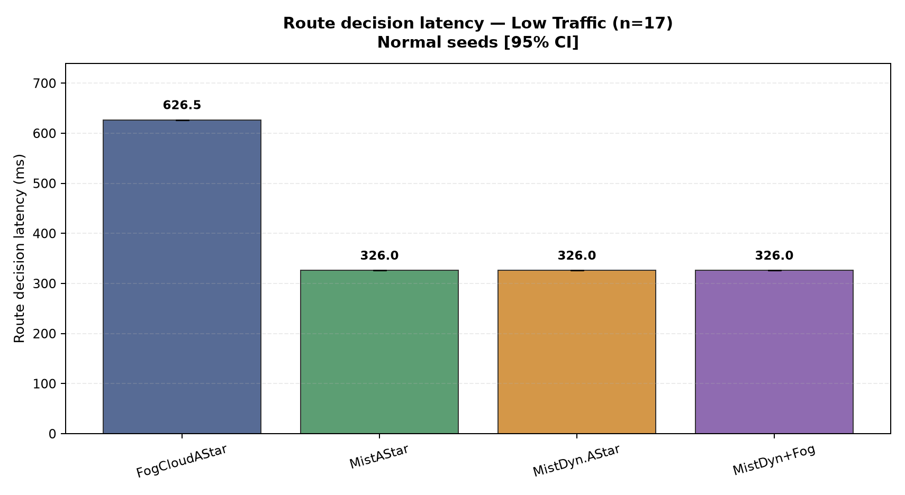

Low traffic, normal operation: Fog/Cloud 626.54 ms (n=17); Mist 326.00 ms (n=17); Mist Dynamic 326.00 ms (n=17); Mist + Fog 326.00 ms (n=17). Error bars show 95% confidence intervals.

Medium traffic, normal operation: Fog/Cloud 626.54 ms (n=21); Mist 326.00 ms (n=21); Mist Dynamic 326.00 ms (n=21); Mist + Fog 326.00 ms (n=21). Error bars show 95% confidence intervals.

High traffic, normal operation: Fog/Cloud 626.54 ms (n=22); Mist 326.00 ms (n=22); Mist Dynamic 326.00 ms (n=22); Mist + Fog 326.00 ms (n=22). Error bars show 95% confidence intervals.

### Normal operation ev response time

These figures separate seeds without a stall from seeds assigned the controlled 900 ms Mist stall. Fog/Cloud is unaffected by that local stall.

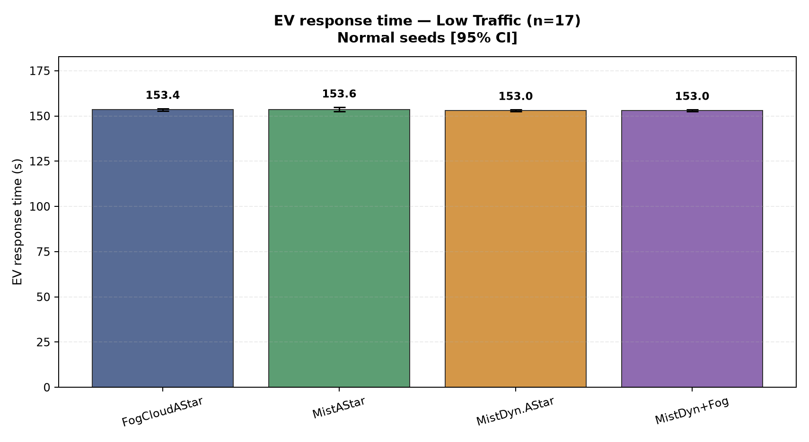

Low traffic, normal operation: Fog/Cloud 153.41 s (n=17); Mist 153.65 s (n=17); Mist Dynamic 146.94 s (n=17); Mist + Fog 146.94 s (n=17). Error bars show 95% confidence intervals.

Medium traffic, normal operation: Fog/Cloud 154.76 s (n=21); Mist 155.05 s (n=21); Mist Dynamic 147.55 s (n=21); Mist + Fog 147.55 s (n=21). Error bars show 95% confidence intervals.

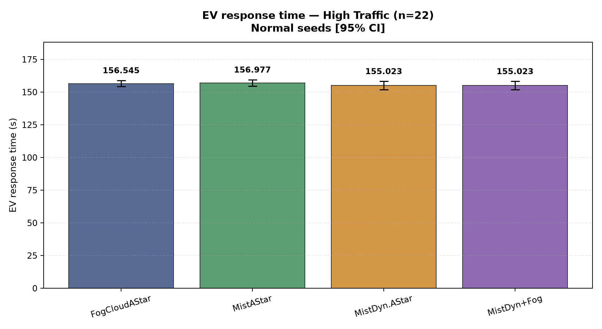

High traffic, normal operation: Fog/Cloud 156.55 s (n=22); Mist 156.98 s (n=22); Mist Dynamic 146.66 s (n=22); Mist + Fog 146.66 s (n=22). Error bars show 95% confidence intervals.

### Controlled Mist stalls route decision latency

These figures separate seeds without a stall from seeds assigned the controlled 900 ms Mist stall. Fog/Cloud is unaffected by that local stall.

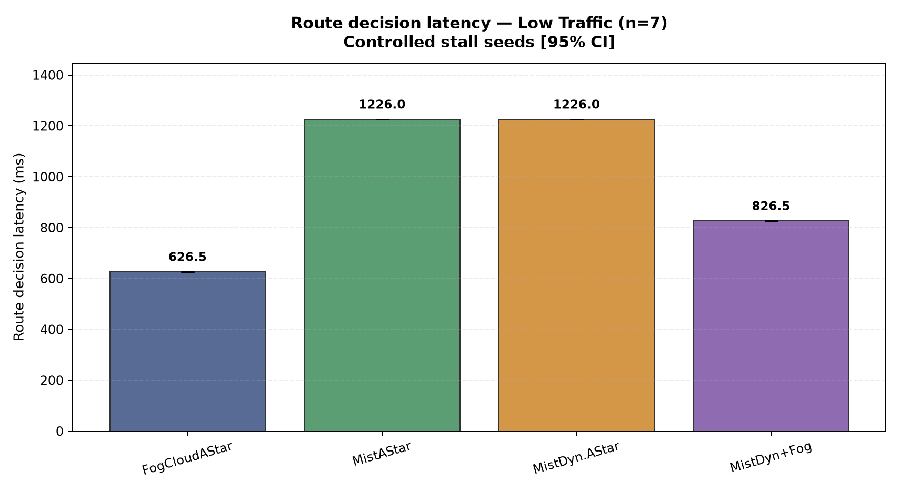

Low traffic, controlled mist stalls: Fog/Cloud 626.54 ms (n=7); Mist 1226.00 ms (n=7); Mist Dynamic 1226.00 ms (n=7); Mist + Fog 826.54 ms (n=7). Error bars show 95% confidence intervals.

Medium traffic, controlled mist stalls: Fog/Cloud 626.54 ms (n=8); Mist 1226.00 ms (n=8); Mist Dynamic 1226.00 ms (n=8); Mist + Fog 826.60 ms (n=8). Error bars show 95% confidence intervals.

High traffic, controlled mist stalls: Fog/Cloud 626.54 ms (n=8); Mist 1226.00 ms (n=8); Mist Dynamic 1226.00 ms (n=8); Mist + Fog 826.63 ms (n=8). Error bars show 95% confidence intervals.

### Controlled Mist stalls ev response time

These figures separate seeds without a stall from seeds assigned the controlled 900 ms Mist stall. Fog/Cloud is unaffected by that local stall.

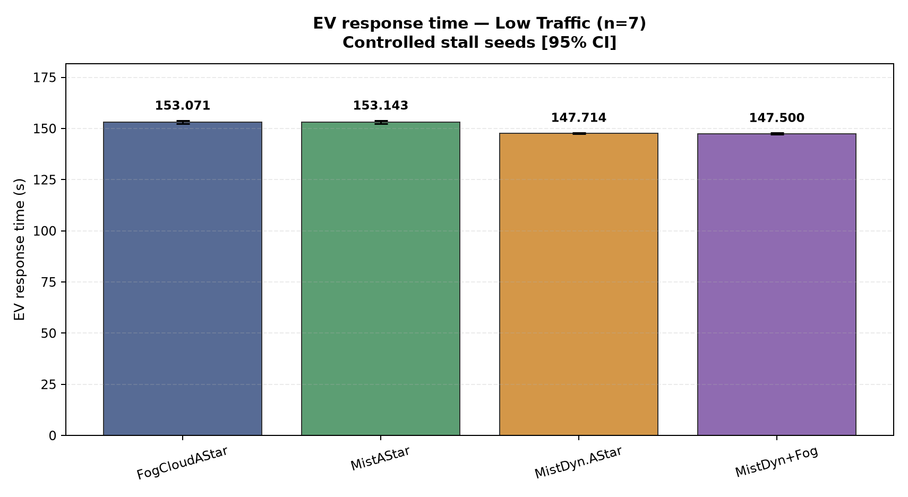

Low traffic, controlled mist stalls: Fog/Cloud 153.07 s (n=7); Mist 153.14 s (n=7); Mist Dynamic 147.71 s (n=7); Mist + Fog 147.50 s (n=7). Error bars show 95% confidence intervals.

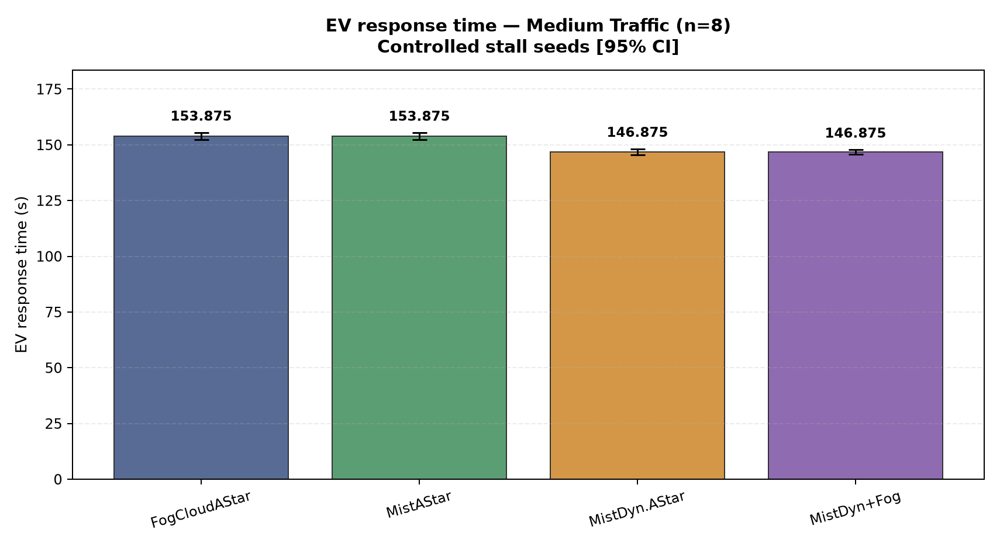

Medium traffic, controlled mist stalls: Fog/Cloud 153.88 s (n=8); Mist 153.88 s (n=8); Mist Dynamic 146.88 s (n=8); Mist + Fog 146.88 s (n=8). Error bars show 95% confidence intervals.

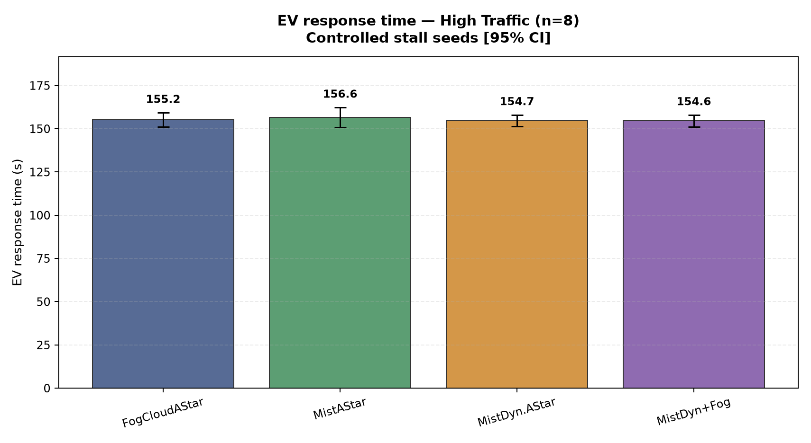

High traffic, controlled mist stalls: Fog/Cloud 155.25 s (n=8); Mist 156.62 s (n=8); Mist Dynamic 149.88 s (n=8); Mist + Fog 146.94 s (n=8). Error bars show 95% confidence intervals.

### Matched seed differences in ev response time

Each bar subtracts configuration B from A for the same delivered seeds. Below zero means A is faster. An interval crossing zero does not establish a difference; these comparisons are exploratory and not adjusted for multiple testing.

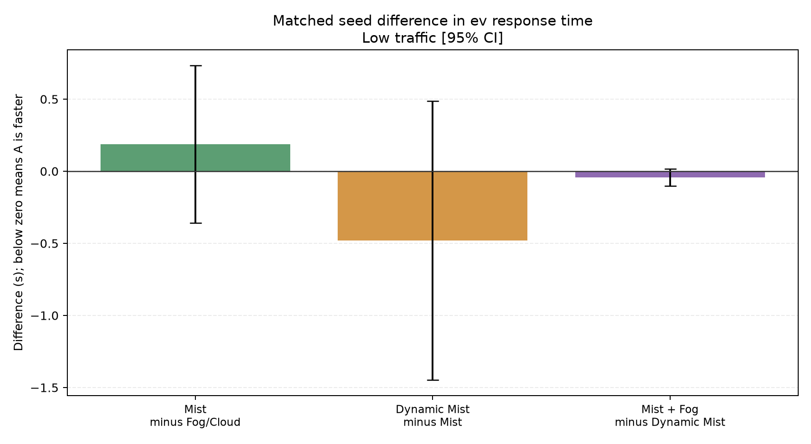

Low traffic: Mist minus Fog/Cloud 0.19 s, 95% CI [-0.36, 0.73], n=24; Mist Dynamic minus Mist -6.33 s, 95% CI [-7.31, -5.35], n=24; Mist + Fog minus Mist Dynamic -0.06 s, 95% CI [-0.13, 0.01], n=24.

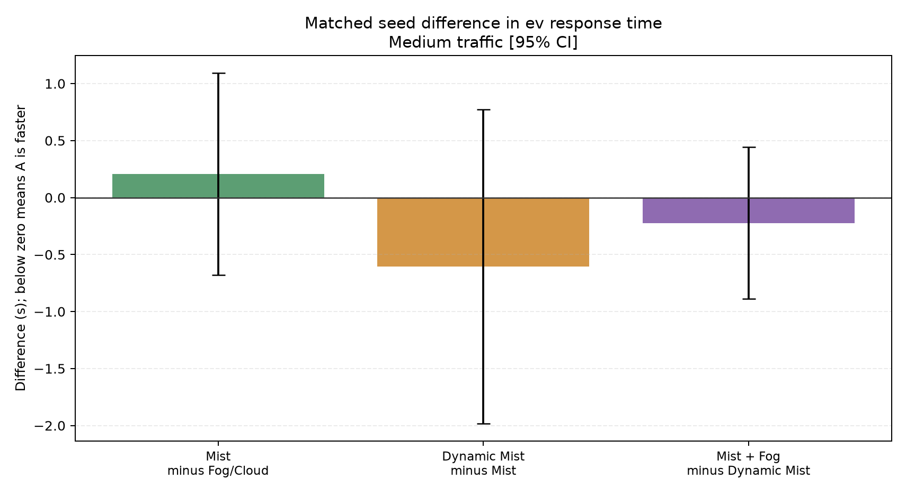

Medium traffic: Mist minus Fog/Cloud 0.21 s, 95% CI [-0.68, 1.09], n=29; Mist Dynamic minus Mist -7.36 s, 95% CI [-8.61, -6.11], n=29; Mist + Fog minus Mist Dynamic 0.00 s, 95% CI [-0.14, 0.14], n=29.

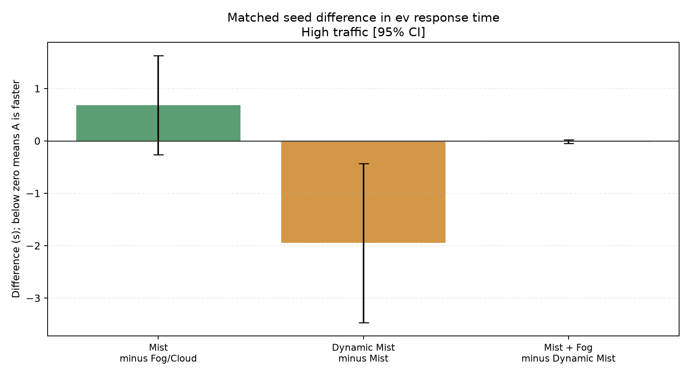

High traffic: Mist minus Fog/Cloud 0.68 s, 95% CI [-0.26, 1.63], n=30; Mist Dynamic minus Mist -9.37 s, 95% CI [-11.40, -7.33], n=30; Mist + Fog minus Mist Dynamic -0.78 s, 95% CI [-2.21, 0.65], n=30.

### Matched seed differences in route decision latency

Each bar subtracts configuration B from A for the same delivered seeds. Below zero means A is faster. An interval crossing zero does not establish a difference; these comparisons are exploratory and not adjusted for multiple testing.

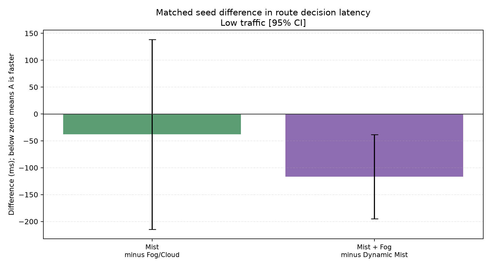

Low traffic: Mist minus Fog/Cloud -38.04 ms, 95% CI [-214.49, 138.41], n=24; Mist + Fog minus Mist Dynamic -116.51 ms, 95% CI [-194.83, -38.19], n=24.

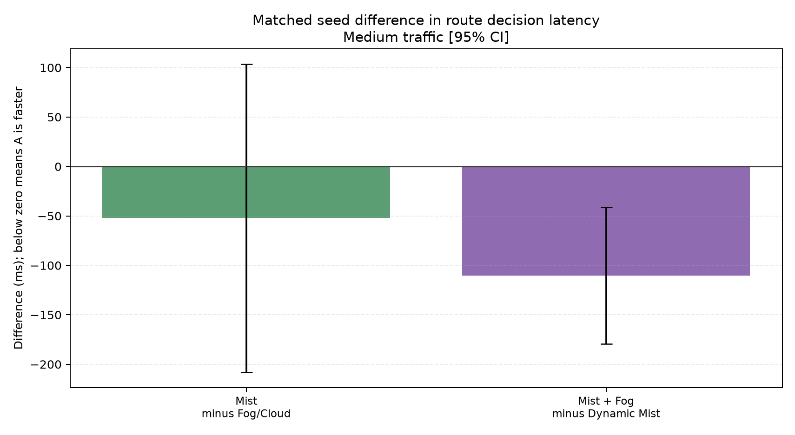

Medium traffic: Mist minus Fog/Cloud -52.27 ms, 95% CI [-207.98, 103.45], n=29; Mist + Fog minus Mist Dynamic -110.18 ms, 95% CI [-179.28, -41.08], n=29.

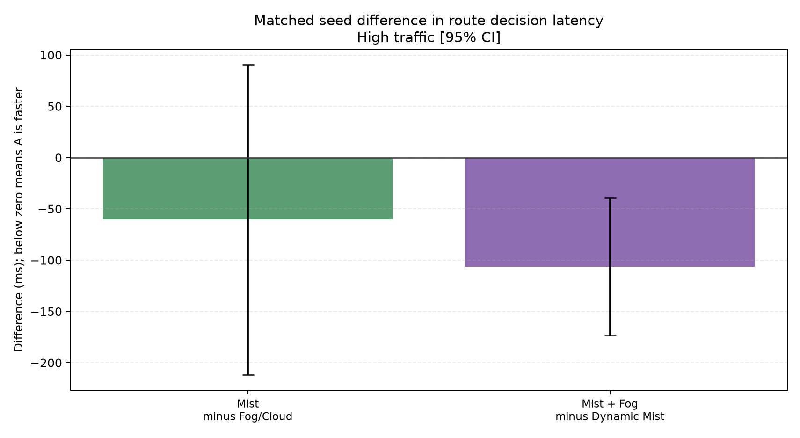

High traffic: Mist minus Fog/Cloud -60.54 ms, 95% CI [-211.69, 90.61], n=30; Mist + Fog minus Mist Dynamic -106.50 ms, 95% CI [-173.57, -39.42], n=30.

### Fog route requests

Mean wireless Fog route requests per scheduled run. Local Mist needs no Fog request. These counts are separate from the emergency alert.

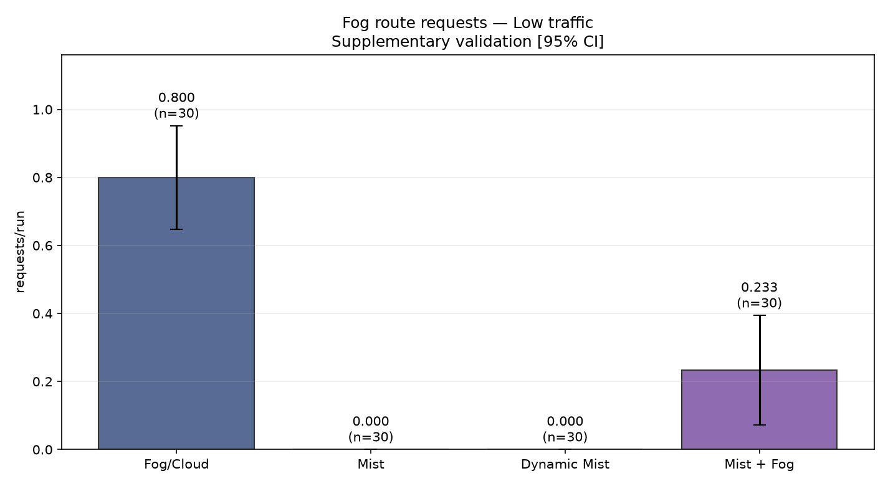

Low traffic: Fog/Cloud 0.800 requests/run (n=30); Mist 0.000 requests/run (n=30); Mist Dynamic 0.000 requests/run (n=30); Mist + Fog 0.233 requests/run (n=30). Error bars show 95% confidence intervals.

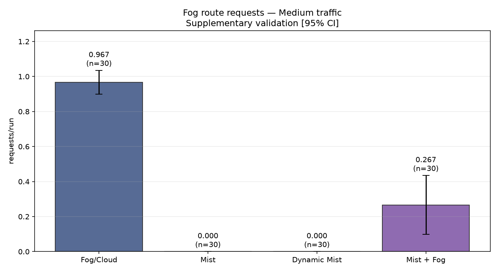

Medium traffic: Fog/Cloud 0.967 requests/run (n=30); Mist 0.000 requests/run (n=30); Mist Dynamic 0.000 requests/run (n=30); Mist + Fog 0.267 requests/run (n=30). Error bars show 95% confidence intervals.

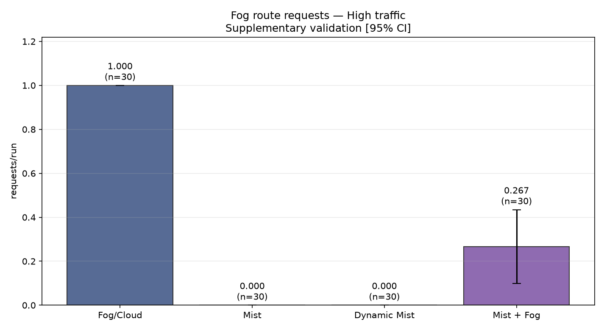

High traffic: Fog/Cloud 1.000 requests/run (n=30); Mist 0.000 requests/run (n=30); Mist Dynamic 0.000 requests/run (n=30); Mist + Fog 0.267 requests/run (n=30). Error bars show 95% confidence intervals.

### Fog route transaction turnaround

Time from sending a Fog request to accepting its route reply. Processing and Cloud backhaul are included; watchdog waiting is excluded. Local-only Mist has no wireless transaction.

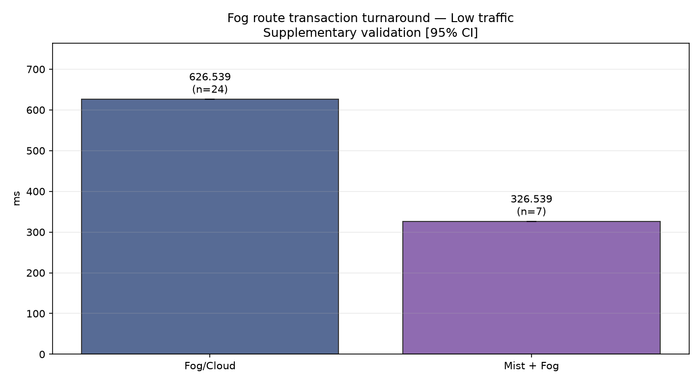

Low traffic: Fog/Cloud 626.539 ms (n=24); Mist + Fog 326.539 ms (n=7). Error bars show 95% confidence intervals.

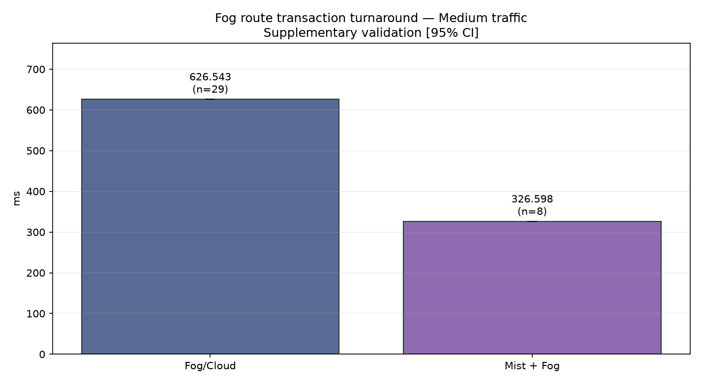

Medium traffic: Fog/Cloud 626.543 ms (n=29); Mist + Fog 326.598 ms (n=8). Error bars show 95% confidence intervals.

High traffic: Fog/Cloud 626.539 ms (n=30); Mist + Fog 326.630 ms (n=8). Error bars show 95% confidence intervals.

### Fog route network round trip

Request and reply network time after subtracting processing and Cloud backhaul. The 500 ms watchdog wait is also excluded.

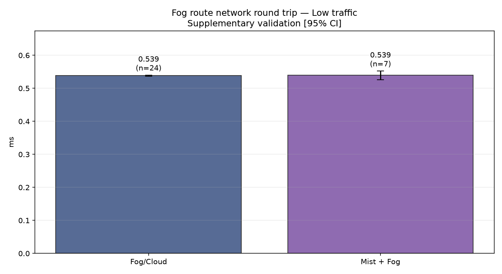

Low traffic: Fog/Cloud 0.539 ms (n=24); Mist + Fog 0.539 ms (n=7). Error bars show 95% confidence intervals.

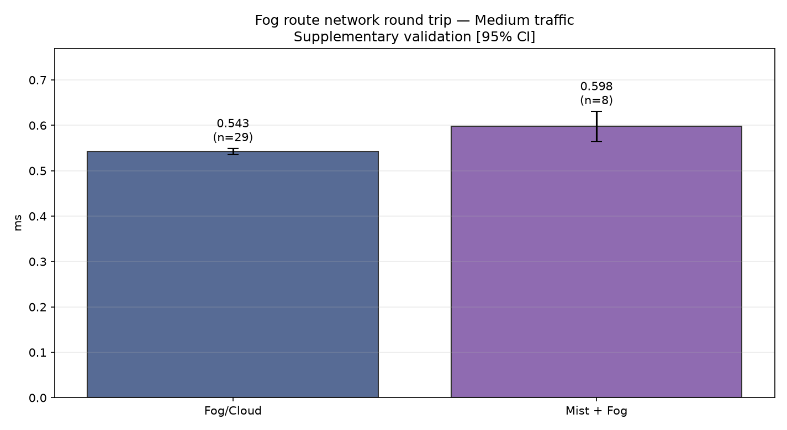

Medium traffic: Fog/Cloud 0.543 ms (n=29); Mist + Fog 0.598 ms (n=8). Error bars show 95% confidence intervals.

High traffic: Fog/Cloud 0.539 ms (n=30); Mist + Fog 0.630 ms (n=8). Error bars show 95% confidence intervals.

### Short notice red signal validation

Isolated red-signal scenarios use two matched seeds per density. Priority is deliberately requested late, within 10 metres or half a second. These stress tests are separate from the main comparison.

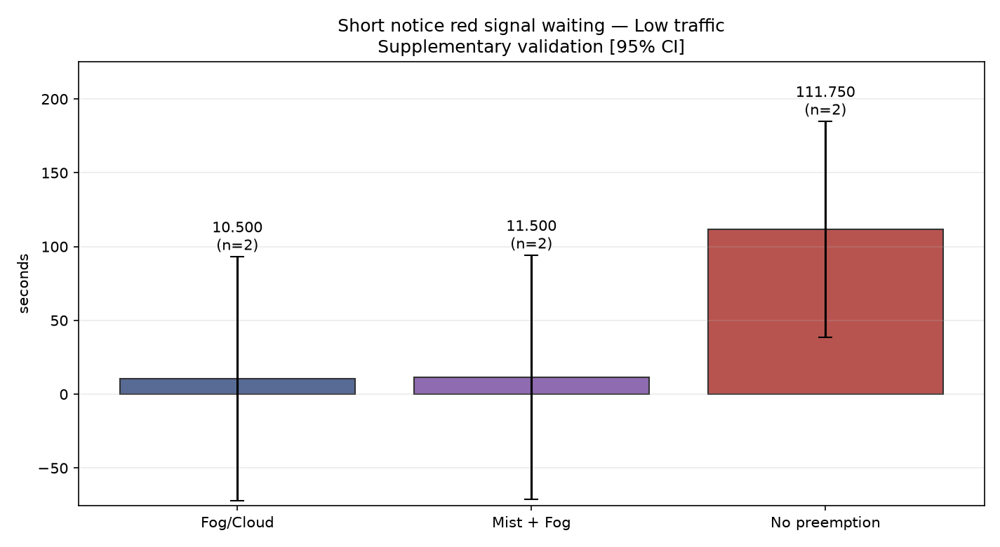

Low traffic: Fog/Cloud 10.500 s (n=2); Mist + Fog 11.500 s (n=2); No preemption 111.750 s (n=2). Error bars show 95% confidence intervals.

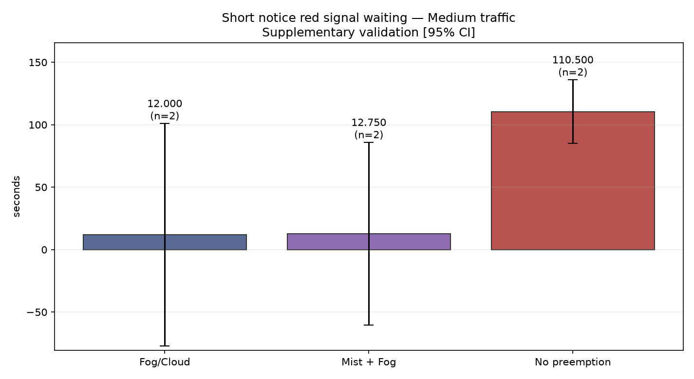

Medium traffic: Fog/Cloud 12.000 s (n=2); Mist + Fog 12.750 s (n=2); No preemption 110.500 s (n=2). Error bars show 95% confidence intervals.

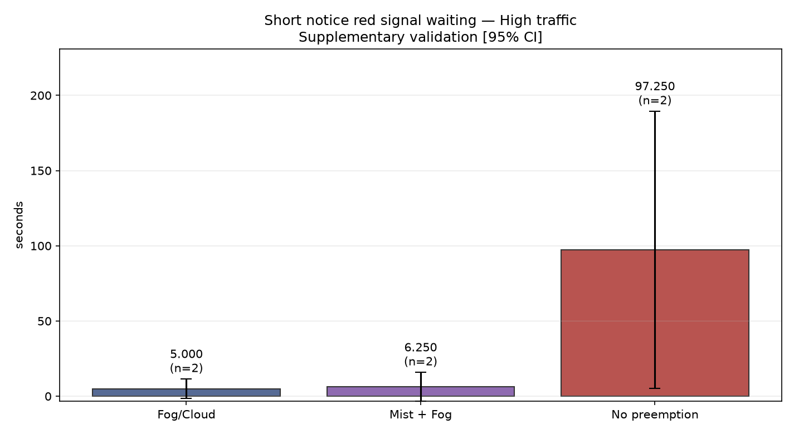

High traffic: Fog/Cloud 5.000 s (n=2); Mist + Fog 6.250 s (n=2); No preemption 97.250 s (n=2). Error bars show 95% confidence intervals.

### Controlled incident response

A separate matched experiment adds the same stopped queue after the initial route decision. These values measure response under that incident, not ordinary traffic.

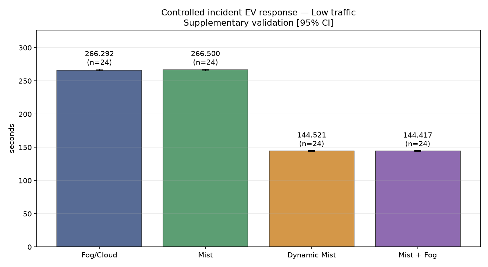

Low traffic: Fog/Cloud 266.292 s (n=24); Mist 266.500 s (n=24); Mist Dynamic 144.521 s (n=24); Mist + Fog 144.417 s (n=24). Error bars show 95% confidence intervals.

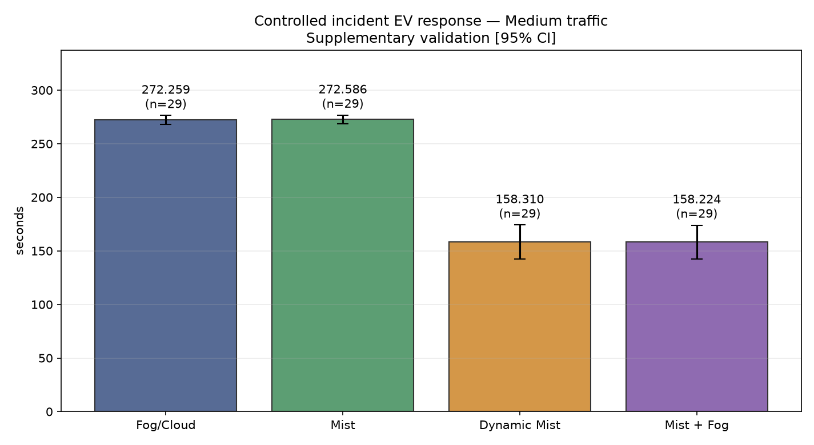

Medium traffic: Fog/Cloud 272.259 s (n=29); Mist 272.586 s (n=29); Mist Dynamic 158.310 s (n=29); Mist + Fog 158.224 s (n=29). Error bars show 95% confidence intervals.

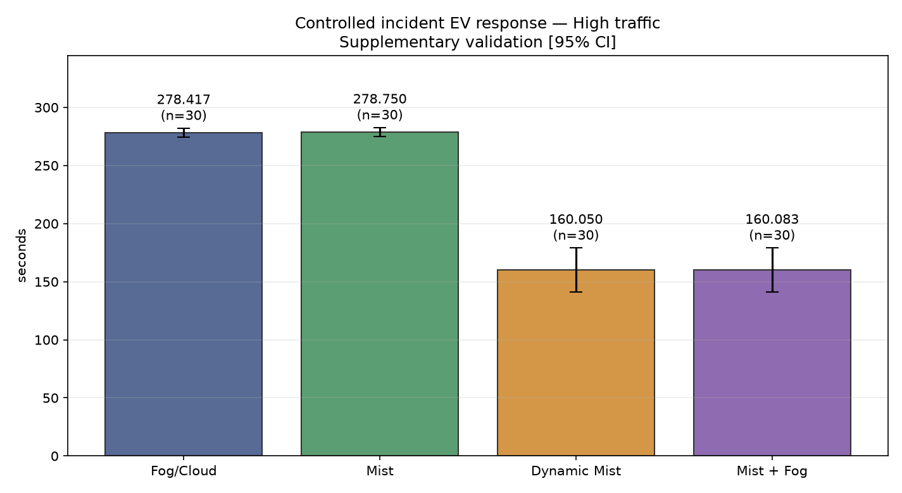

High traffic: Fog/Cloud 278.417 s (n=30); Mist 278.750 s (n=30); Mist Dynamic 160.050 s (n=30); Mist + Fog 160.083 s (n=30). Error bars show 95% confidence intervals.

### Controlled incident route changes

Actual route replacements based on received traffic reports in the incident experiment. No routing costs or route choices are hardcoded.

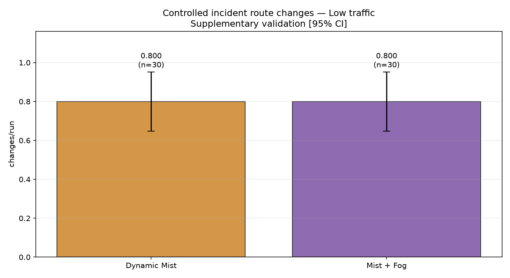

Low traffic: Mist Dynamic 0.800 changes/run (n=30); Mist + Fog 0.800 changes/run (n=30). Error bars show 95% confidence intervals.

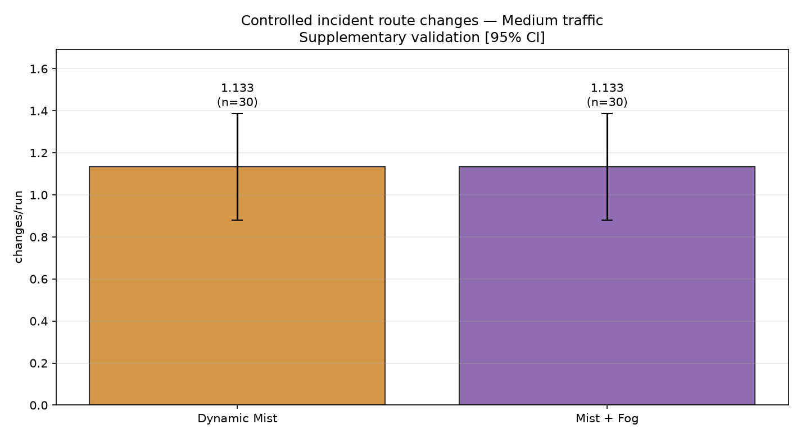

Medium traffic: Mist Dynamic 1.133 changes/run (n=30); Mist + Fog 1.133 changes/run (n=30). Error bars show 95% confidence intervals.

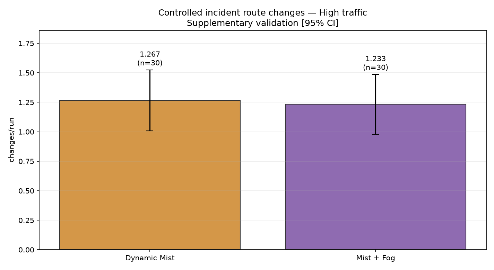

High traffic: Mist Dynamic 1.167 changes/run (n=30); Mist + Fog 1.167 changes/run (n=30). Error bars show 95% confidence intervals.

### Controlled fault route decision time saved

Matched time saved by Fog fallback against Dynamic Mist under the same controlled 900 ms stall in the original batch. This is route readiness, not journey time.

Low traffic: Mist + Fog 399.461 ms (n=7). Error bars show 95% confidence intervals.

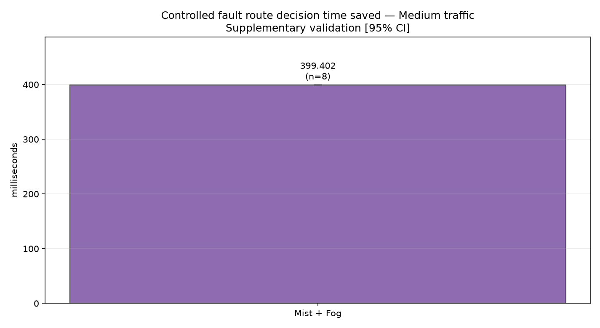

Medium traffic: Mist + Fog 399.402 ms (n=8). Error bars show 95% confidence intervals.

High traffic: Mist + Fog 399.370 ms (n=8). Error bars show 95% confidence intervals.

### Controlled incident matched response differences

Negative means the first algorithm is faster. The paired interval quantifies uncertainty. A controlled obstacle does not establish the same benefit in ordinary traffic.

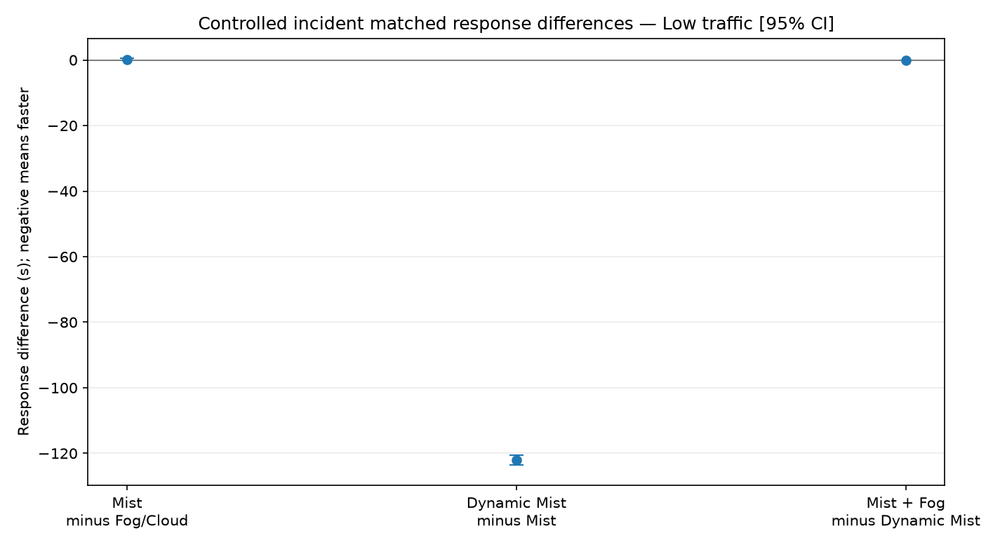

Low traffic: Mist minus Fog/Cloud 0.208 s, 95% CI [-0.032, 0.449], n=24; Mist Dynamic minus Mist -121.979 s, 95% CI [-123.468, -120.491], n=24; Mist + Fog minus Mist Dynamic -0.104 s, 95% CI [-0.192, -0.017], n=24.

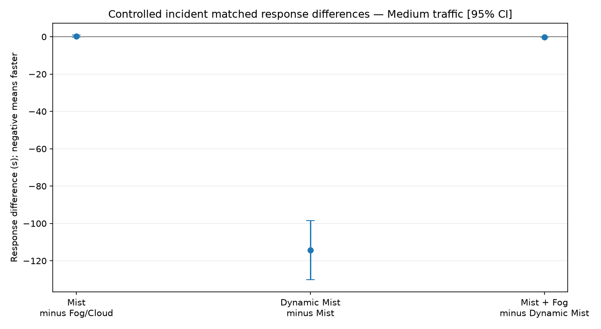

Medium traffic: Mist minus Fog/Cloud 0.328 s, 95% CI [-0.176, 0.831], n=29; Mist Dynamic minus Mist -114.276 s, 95% CI [-130.017, -98.535], n=29; Mist + Fog minus Mist Dynamic -0.086 s, 95% CI [-0.189, 0.016], n=29.

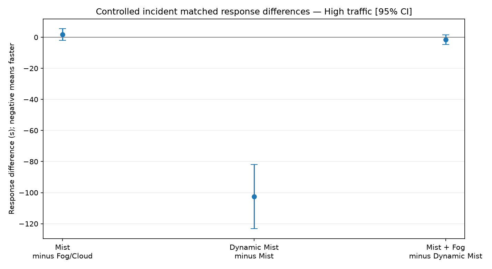

High traffic: Mist minus Fog/Cloud 0.333 s, 95% CI [-0.320, 0.986], n=30; Mist Dynamic minus Mist -118.700 s, 95% CI [-138.595, -98.805], n=30; Mist + Fog minus Mist Dynamic 0.033 s, 95% CI [-0.121, 0.188], n=30.

### Direct baseline route decision latency

Time from alert reception to the initial route, in milliseconds. Lower is better.

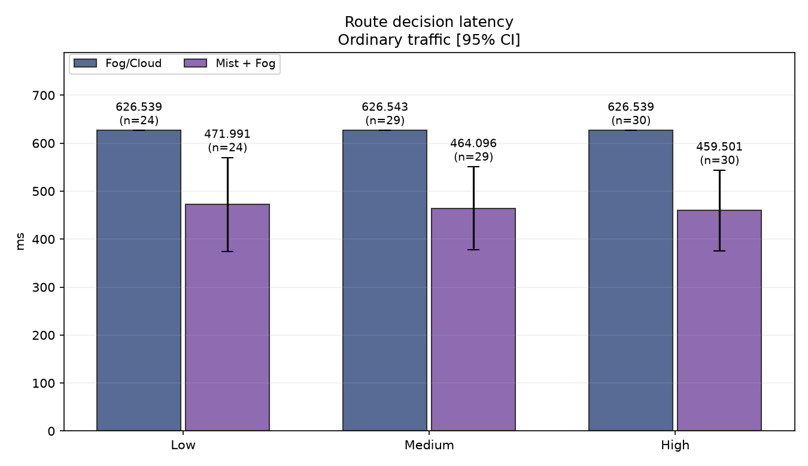

Ordinary traffic: Low Fog 626.539, proposed 471.991, reduction 24.67%, paired n=24; Medium Fog 626.543, proposed 464.096, reduction 25.93%, paired n=29; High Fog 626.539, proposed 459.501, reduction 26.66%, paired n=30. Error bars show 95% confidence intervals.

### Direct baseline EV response time

Time from alert generation to arrival, in seconds. Lower is better. The framework comparison includes both routing and signal-request policy.

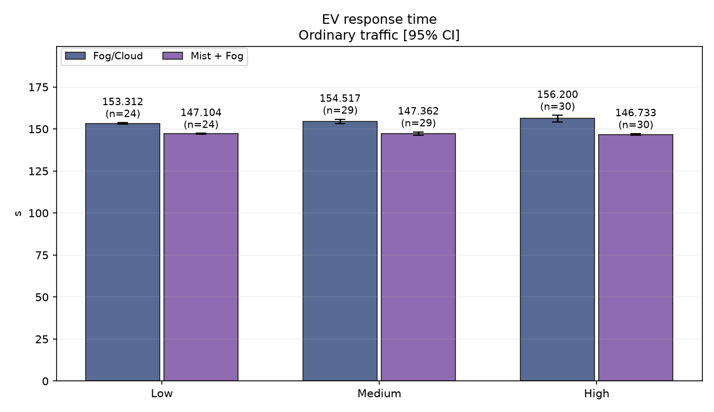

Ordinary traffic: Low Fog 153.312, proposed 147.104, reduction 4.05%, paired n=24; Medium Fog 154.517, proposed 147.362, reduction 4.63%, paired n=29; High Fog 156.200, proposed 146.733, reduction 6.06%, paired n=30. Error bars show 95% confidence intervals.

### Direct baseline signal waiting

Standstill near a signal stop line, in seconds. Lower is better; a genuine green arrival may have zero waiting.

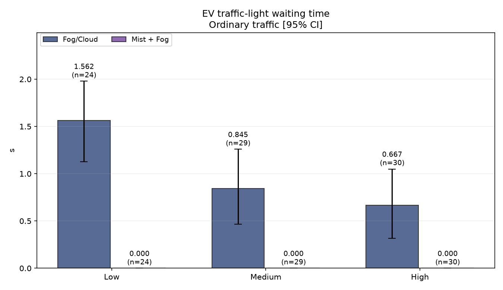

Ordinary traffic: Low Fog 1.562, proposed 0.000, reduction 100.00%, paired n=24; Medium Fog 0.845, proposed 0.000, reduction 100.00%, paired n=29; High Fog 0.667, proposed 0.000, reduction 100.00%, paired n=30. Error bars show 95% confidence intervals.

### Excess travel delay above free flow

Actual EV travel time minus traveled distance divided by 13.9 m/s, bounded at zero. Lower is better. This supporting metric is correlated with response time.

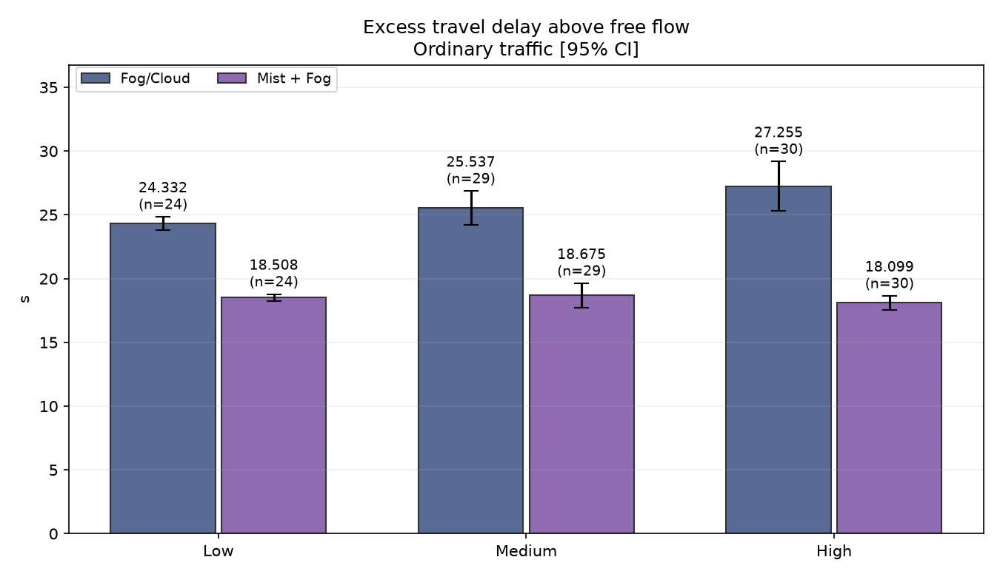

Ordinary traffic: Low Fog 24.332, proposed 18.508, reduction 23.94%, paired n=24; Medium Fog 25.537, proposed 18.675, reduction 26.87%, paired n=29; High Fog 27.255, proposed 18.099, reduction 33.59%, paired n=30. Error bars show 95% confidence intervals.

### Fog route requests per run

Actual initial RouteRequest send events at the EV. Lower means fewer remote route transactions. This is not a count of relays or EM delivery.

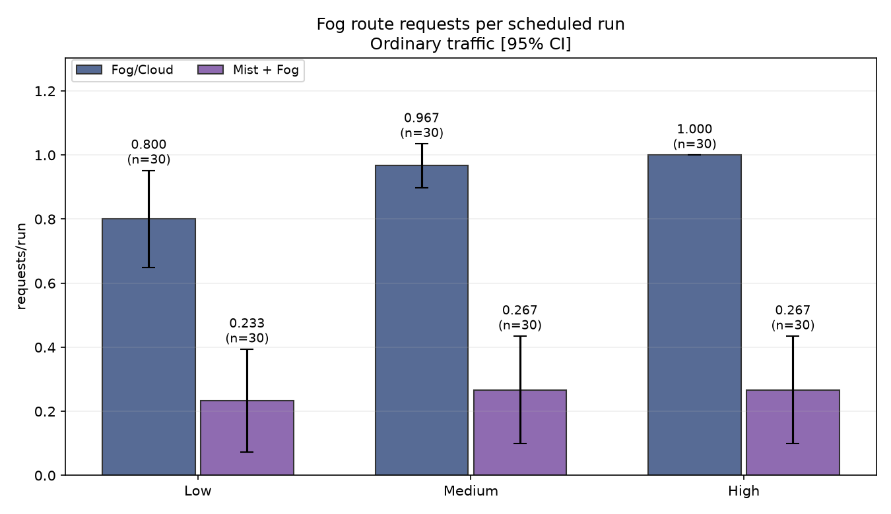

Ordinary traffic: Low Fog 0.800, proposed 0.233, reduction 70.83%, paired n=30; Medium Fog 0.967, proposed 0.267, reduction 72.41%, paired n=30; High Fog 1.000, proposed 0.267, reduction 73.33%, paired n=30. Error bars show 95% confidence intervals.

### Direct baseline route decision latency

Time from alert reception to the initial route, in milliseconds. Lower is better.

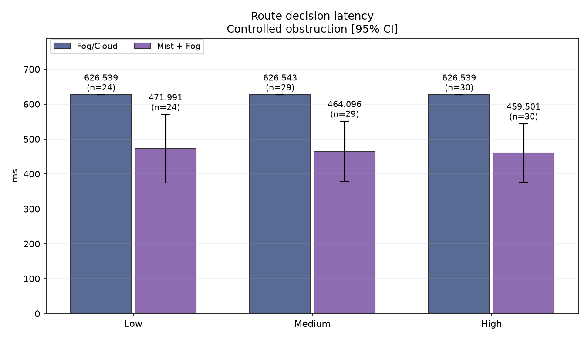

Controlled obstruction: Low Fog 626.539, proposed 471.991, reduction 24.67%, paired n=24; Medium Fog 626.543, proposed 464.096, reduction 25.93%, paired n=29; High Fog 626.539, proposed 459.501, reduction 26.66%, paired n=30. Error bars show 95% confidence intervals.

### Direct baseline EV response time

Time from alert generation to arrival, in seconds. Lower is better. The framework comparison includes both routing and signal-request policy.

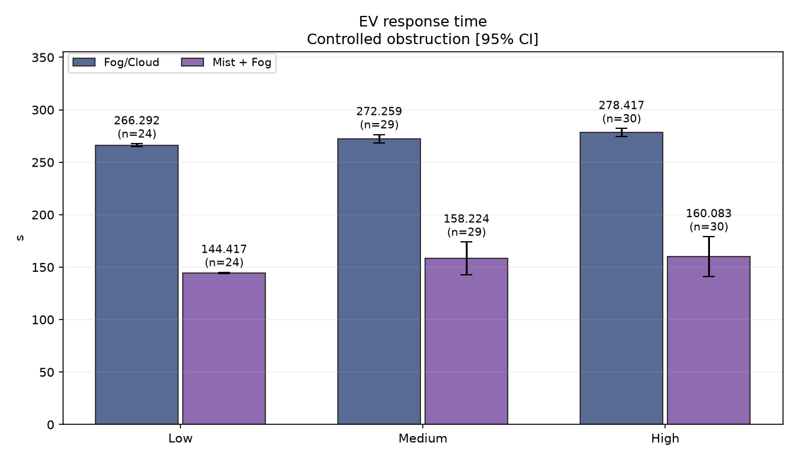

Controlled obstruction: Low Fog 266.292, proposed 144.417, reduction 45.77%, paired n=24; Medium Fog 272.259, proposed 158.224, reduction 41.88%, paired n=29; High Fog 278.417, proposed 160.083, reduction 42.50%, paired n=30. Error bars show 95% confidence intervals.

### Direct baseline signal waiting

Standstill near a signal stop line, in seconds. Lower is better; a genuine green arrival may have zero waiting.

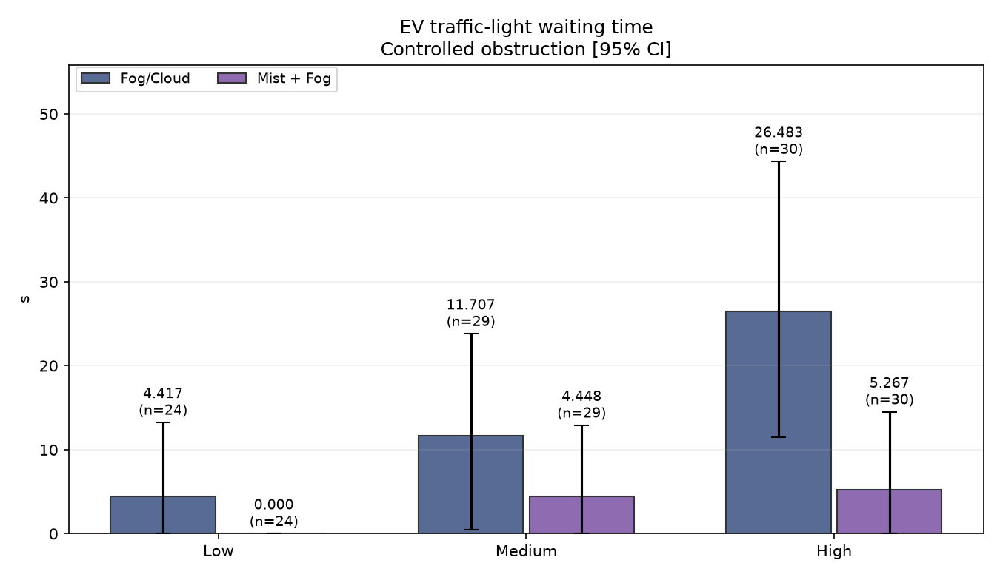

Controlled obstruction: Low Fog 4.417, proposed 0.000, reduction 100.00%, paired n=24; Medium Fog 11.707, proposed 4.448, reduction 62.00%, paired n=29; High Fog 26.483, proposed 5.267, reduction 80.11%, paired n=30. Error bars show 95% confidence intervals.

### Excess travel delay above free flow

Actual EV travel time minus traveled distance divided by 13.9 m/s, bounded at zero. Lower is better. This supporting metric is correlated with response time.

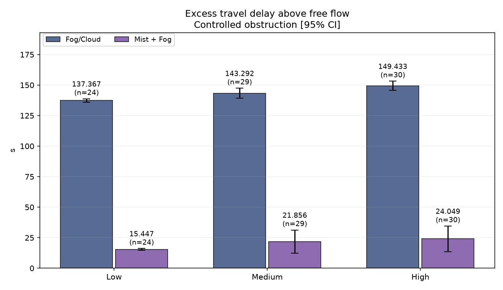

Controlled obstruction: Low Fog 137.367, proposed 15.447, reduction 88.76%, paired n=24; Medium Fog 143.292, proposed 21.856, reduction 84.75%, paired n=29; High Fog 149.433, proposed 24.049, reduction 83.91%, paired n=30. Error bars show 95% confidence intervals.

### Fog route requests per run

Actual initial RouteRequest send events at the EV. Lower means fewer remote route transactions. This is not a count of relays or EM delivery.

Controlled obstruction: Low Fog 0.800, proposed 0.233, reduction 70.83%, paired n=30; Medium Fog 0.967, proposed 0.267, reduction 72.41%, paired n=30; High Fog 1.000, proposed 0.267, reduction 73.33%, paired n=30. Error bars show 95% confidence intervals.

The complete numeric means, valid sample sizes, standard deviations, and intervals are in `../results/processed/summary-batch.csv`. The seven main measures are also tabulated in `VERIFICATION.md`.
