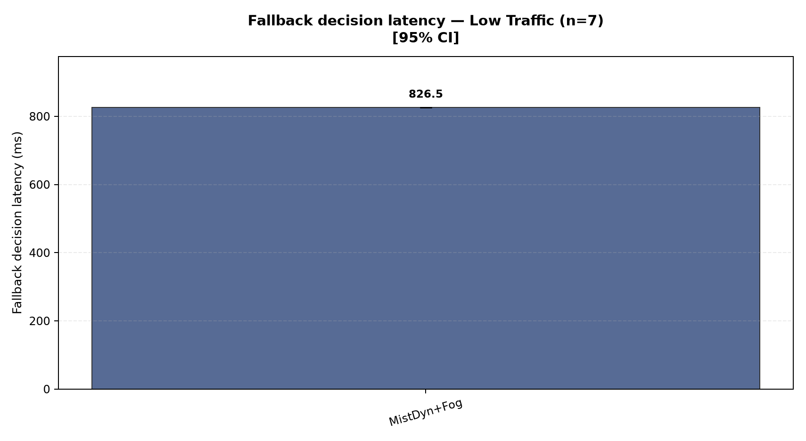

# Emergency vehicle navigation: project and graph guide

This project studies how an emergency vehicle receives an accident alert and chooses a route through traffic. The Word report contains the complete project explanation and the same 48 graphs.

## How the system works

1. Create a small road network with 16 junctions and traffic lights. Put three roadside units (RSUs) beside the roads. Each RSU can communicate within a 400 m radio neighborhood.

2. Add normal traffic to the roads. The low, medium, and high traffic scenarios contain 72, 144, and 200 background vehicles. Thirty random seeds give different trips for each scenario.

3. Start the emergency event. An accident vehicle stops, and the nearby RSU sends one 256-byte emergency message through the vehicle and roadside network to the emergency vehicle (EV).

4. When the EV receives the message, calculate a route to the accident using the selected routing configuration. Some configurations use a fixed A* route; the dynamic configurations review live road costs every five seconds.

5. While the EV drives under SUMO car-following and signal safety rules, it requests traffic-light priority within 100 m or eight seconds. The controller preserves a minimum ten-second green for traffic already being served, then clears the junction with yellow and all-red before changing priority.

6. Mist normally computes the route with no added telemetry validation delay. Eight independently selected seeds receive a controlled 900 ms Mist stall in all three Mist approaches. In Mist with Fog, unfinished work after 500 ms triggers a Fog request. These are labeled fault tests, not naturally occurring failures.

7. Record whether the message arrived, how long communication and route decisions took, how the EV traveled, and how many reviews, route changes, and fallback events occurred. Each run has a 900 second observation window.

8. Repeat the four primary configurations at three traffic levels and 30 matched seeds: 360 runs. Add 90 no-preemption control runs, displayed only for traffic-light waiting. Calculate averages and 95% confidence intervals, report normal and controlled-stall results separately, and draw the graphs.

## How to read the figures

Each bar is a density and configuration mean. Error bars show 95% confidence intervals; the exact methods are in [METHODOLOGY.md](METHODOLOGY.md). Metrics requiring EM delivery use only valid delivered runs. PDR, EM throughput, and fallback activation use all 30 scheduled runs where applicable. Fallback latency uses only runs where the watchdog actually activated.

## All 48 graphs

### Packet delivery ratio

The share of generated emergency messages that reached the EV. Higher is better.

Low traffic (72 background vehicles): Fog/Cloud 0.800; Mist 0.800; Mist Dynamic 0.800; Mist + Fog 0.800. Bars show means and 95% confidence intervals.

Medium traffic (144 background vehicles): Fog/Cloud 0.967; Mist 0.967; Mist Dynamic 0.967; Mist + Fog 0.967. Bars show means and 95% confidence intervals.

High traffic (200 background vehicles): Fog/Cloud 1.000; Mist 1.000; Mist Dynamic 1.000; Mist + Fog 1.000. Bars show means and 95% confidence intervals.

### Normalized routing load

Control and EM transmissions per delivered emergency message. Lower means less communication overhead.

Low traffic (72 background vehicles): Fog/Cloud 22,039; Mist 22,046; Mist Dynamic 22,038; Mist + Fog 22,033. Bars show means and 95% confidence intervals.

Medium traffic (144 background vehicles): Fog/Cloud 39,771; Mist 39,739; Mist Dynamic 39,766; Mist + Fog 39,738. Bars show means and 95% confidence intervals.

High traffic (200 background vehicles): Fog/Cloud 54,379; Mist 54,257; Mist Dynamic 54,211; Mist + Fog 54,257. Bars show means and 95% confidence intervals.

### EM throughput

Delivered EM payload bits divided by the fixed 900 second observation window. One delivery contributes 2.27556 bit/s.

Low traffic (72 background vehicles): Fog/Cloud 1.820; Mist 1.820; Mist Dynamic 1.820; Mist + Fog 1.820. Bars show means and 95% confidence intervals.

Medium traffic (144 background vehicles): Fog/Cloud 2.200; Mist 2.200; Mist Dynamic 2.200; Mist + Fog 2.200. Bars show means and 95% confidence intervals.

High traffic (200 background vehicles): Fog/Cloud 2.276; Mist 2.276; Mist Dynamic 2.276; Mist + Fog 2.276. Bars show means and 95% confidence intervals.

### EM end-to-end delay

Time from RSU message generation to EV reception, in milliseconds. Lower is faster.

Low traffic (72 background vehicles): Fog/Cloud 44.4; Mist 44.4; Mist Dynamic 44.4; Mist + Fog 44.4. Bars show means and 95% confidence intervals.

Medium traffic (144 background vehicles): Fog/Cloud 37.1; Mist 37.1; Mist Dynamic 37.1; Mist + Fog 37.1. Bars show means and 95% confidence intervals.

High traffic (200 background vehicles): Fog/Cloud 32.2; Mist 32.2; Mist Dynamic 32.2; Mist + Fog 32.2. Bars show means and 95% confidence intervals.

### Route decision latency

Time from EV message reception to the initial route being applied, in milliseconds.

Low traffic (72 background vehicles): Fog/Cloud 626.5; Mist 588.5; Mist Dynamic 588.5; Mist + Fog 472.0. Bars show means and 95% confidence intervals.

Medium traffic (144 background vehicles): Fog/Cloud 626.5; Mist 574.3; Mist Dynamic 574.3; Mist + Fog 464.1. Bars show means and 95% confidence intervals.

High traffic (200 background vehicles): Fog/Cloud 626.5; Mist 566.0; Mist Dynamic 566.0; Mist + Fog 459.5. Bars show means and 95% confidence intervals.

### EV response time

Time from emergency message generation until the EV reaches the accident, in seconds.

Low traffic (72 background vehicles): Fog/Cloud 153.3; Mist 153.1; Mist Dynamic 152.5; Mist + Fog 152.5. Bars show means and 95% confidence intervals.

Medium traffic (144 background vehicles): Fog/Cloud 154.6; Mist 155.5; Mist Dynamic 154.4; Mist + Fog 154.1. Bars show means and 95% confidence intervals.

High traffic (200 background vehicles): Fog/Cloud 156.3; Mist 157.0; Mist Dynamic 154.4; Mist + Fog 154.3. Bars show means and 95% confidence intervals.

### EV traffic-light waiting time

EV standstill near a signal stop line, in seconds. A value of zero means no measured wait.

Low traffic (72 background vehicles): Fog/Cloud 1.5; Mist 1.6; Mist Dynamic 2.0; Mist + Fog 2.0; No preemption 26.3. Bars show means and 95% confidence intervals.

Medium traffic (144 background vehicles): Fog/Cloud 0.9; Mist 1.6; Mist Dynamic 1.7; Mist + Fog 1.7; No preemption 27.3. Bars show means and 95% confidence intervals.

High traffic (200 background vehicles): Fog/Cloud 0.7; Mist 0.6; Mist Dynamic 0.7; Mist + Fog 0.6; No preemption 22.7. Bars show means and 95% confidence intervals.

### Fallback activation rate

Share of Mist with Fog runs where the 500 ms watchdog requested Fog. Controlled stalls are explicitly injected in eight of the 30 seeds.

Low traffic (72 background vehicles): Mist + Fog 0.233. Bars show means and 95% confidence intervals.

Medium traffic (144 background vehicles): Mist + Fog 0.267. Bars show means and 95% confidence intervals.

High traffic (200 background vehicles): Mist + Fog 0.267. Bars show means and 95% confidence intervals.

### Applied route changes

Mean number of actual congestion or cost reroutes per run. Reviews without a replacement are excluded.

Low traffic (72 background vehicles): Mist Dynamic 0.13; Mist + Fog 0.13. Bars show means and 95% confidence intervals.

Medium traffic (144 background vehicles): Mist Dynamic 0.23; Mist + Fog 0.27. Bars show means and 95% confidence intervals.

High traffic (200 background vehicles): Mist Dynamic 0.33; Mist + Fog 0.33. Bars show means and 95% confidence intervals.

### Route computation frequency

Mean number of periodic Dynamic A* route evaluations per run, normally scheduled every five seconds.

Low traffic (72 background vehicles): Mist Dynamic 21.90; Mist + Fog 22.00. Bars show means and 95% confidence intervals.

Medium traffic (144 background vehicles): Mist Dynamic 27.33; Mist + Fog 27.17. Bars show means and 95% confidence intervals.

High traffic (200 background vehicles): Mist Dynamic 28.43; Mist + Fog 28.50. Bars show means and 95% confidence intervals.

### Fallback decision latency

Time to apply the Fog route in runs where the watchdog actually triggered, in milliseconds.

Low traffic (72 background vehicles): Mist + Fog 826.5. Bars show means and 95% confidence intervals.

Medium traffic (144 background vehicles): Mist + Fog 826.6. Bars show means and 95% confidence intervals.

High traffic (200 background vehicles): Mist + Fog 826.6. Bars show means and 95% confidence intervals.

### Control transmissions

Mean number of control-packet transmissions per run. This is supporting communication-load evidence.

Low traffic (72 background vehicles): Fog/Cloud 22,663; Mist 22,668; Mist Dynamic 22,662; Mist + Fog 22,658. Bars show means and 95% confidence intervals.

Medium traffic (144 background vehicles): Fog/Cloud 39,997; Mist 39,966; Mist Dynamic 39,992; Mist + Fog 39,965. Bars show means and 95% confidence intervals.

High traffic (200 background vehicles): Fog/Cloud 54,340; Mist 54,218; Mist Dynamic 54,171; Mist + Fog 54,218. Bars show means and 95% confidence intervals.

### Control bytes

Mean control traffic volume in bytes per run. This is supporting communication-load evidence.

Low traffic (72 background vehicles): Fog/Cloud 1,813,206; Mist 1,813,506; Mist Dynamic 1,813,002; Mist + Fog 1,812,736. Bars show means and 95% confidence intervals.

Medium traffic (144 background vehicles): Fog/Cloud 3,200,003; Mist 3,197,365; Mist Dynamic 3,199,463; Mist + Fog 3,197,369. Bars show means and 95% confidence intervals.

High traffic (200 background vehicles): Fog/Cloud 4,347,408; Mist 4,337,520; Mist Dynamic 4,333,800; Mist + Fog 4,337,589. Bars show means and 95% confidence intervals.

### EV corridor delay versus free flow

Extra travel time relative to the modeled free-flow corridor, in seconds.

Low traffic (72 background vehicles): Fog/Cloud 24.3; Mist 24.4; Mist Dynamic 23.8; Mist + Fog 23.9. Bars show means and 95% confidence intervals.

Medium traffic (144 background vehicles): Fog/Cloud 25.6; Mist 26.7; Mist Dynamic 25.6; Mist + Fog 25.5. Bars show means and 95% confidence intervals.

High traffic (200 background vehicles): Fog/Cloud 27.3; Mist 28.2; Mist Dynamic 25.5; Mist + Fog 25.7. Bars show means and 95% confidence intervals.

### EV route distance

Distance traveled by the EV to reach the accident, in metres.

Low traffic (72 background vehicles): Fog/Cloud 1778.7; Mist 1778.1; Mist Dynamic 1778.5; Mist + Fog 1778.6. Bars show means and 95% confidence intervals.

Medium traffic (144 background vehicles): Fog/Cloud 1779.2; Mist 1778.7; Mist Dynamic 1779.2; Mist + Fog 1779.5. Bars show means and 95% confidence intervals.

High traffic (200 background vehicles): Fog/Cloud 1778.9; Mist 1778.9; Mist Dynamic 1780.3; Mist + Fog 1780.1. Bars show means and 95% confidence intervals.

### EV travel time

EV movement time from departure to accident arrival, in seconds.

Low traffic (72 background vehicles): Fog/Cloud 152.3; Mist 152.3; Mist Dynamic 151.7; Mist + Fog 151.9. Bars show means and 95% confidence intervals.

Medium traffic (144 background vehicles): Fog/Cloud 153.6; Mist 154.7; Mist Dynamic 153.6; Mist + Fog 153.5. Bars show means and 95% confidence intervals.

High traffic (200 background vehicles): Fog/Cloud 155.3; Mist 156.2; Mist Dynamic 153.6; Mist + Fog 153.7. Bars show means and 95% confidence intervals.

The complete numeric means, valid sample sizes, standard deviations, and intervals are in `../results/processed/summary-batch.csv`. The seven main measures are also tabulated in `VERIFICATION.md`.
